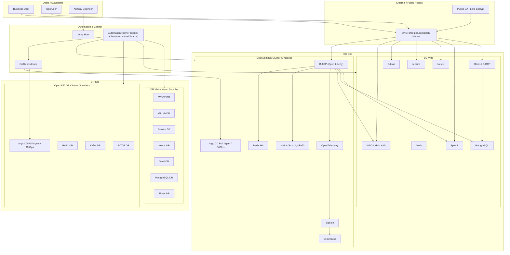
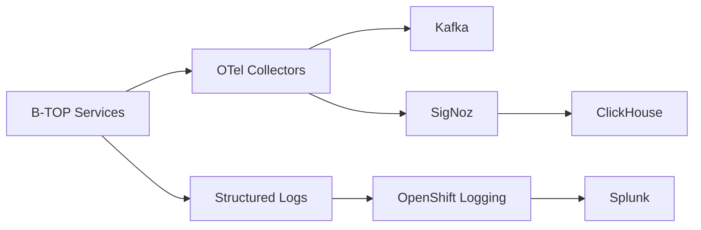
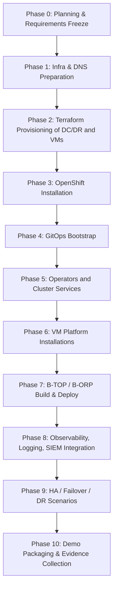
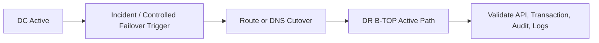

# BRAC Bank POC Implementation Plan  
## Requirement Analysis + Solution Design Document

---

## 1. Executive Summary

Comptech will deliver a controlled Proof of Concept to demonstrate implementation capability across OpenShift, observability, identity and API management, CI/CD, security scanning, high-availability data services, event streaming, middleware, and enterprise Java application hosting.

The POC will be executed in a **vendor-hosted internal lab environment** using:

- **Two 3-node OpenShift clusters** provisioned on VMs using Terraform:
  - **DC cluster**
  - **DR cluster**
- **GitOps-driven OpenShift delivery** using Argo CD with an **agent-based pull model**
- **VM-hosted enterprise shared platforms** for WSO2, GitLab, Jenkins, Nexus, Vault, Splunk, PostgreSQL, and JBoss
- **OpenShift-hosted application and platform services** for B-TOP, Redis, Kafka, observability, logging, and supporting operators
- **Vault-based secret management** and **Vault PKI via cert-manager** for internal certificates
- **Public CA / Let’s Encrypt via cert-manager** for external browser-facing endpoints
- A realistic banking demo application architecture built around:
  - **B-TOP**: Bank Transaction Operations Platform on Open Liberty
  - **B-ORP**: Bank Operations Reconciliation Portal on JBoss

The POC will demonstrate:

- infrastructure automation
- operator-driven platform installation
- application delivery through GitOps
- end-to-end observability
- security enforcement
- auditability
- RBAC
- rate limiting
- Redis HA failover
- Kafka schema enforcement and DLQ
- logging to external SIEM-style tooling
- DR readiness and controlled failover approach

---

## 2. POC Objectives

The objective of this POC is to prove Comptech’s ability to:

1. provision and operate OpenShift through infrastructure-as-code
2. deploy and secure containerized workloads
3. implement modern observability for logs, metrics, and traces
4. deploy and configure enterprise middleware and API management
5. automate CI/CD and GitOps workflows
6. enforce image and dependency security controls
7. demonstrate HA and DR patterns across core services
8. present a realistic banking-oriented application landscape, rather than isolated technical demos

---

## 3. Scope Summary

The BRAC Bank mail requests implementation and justification across the following areas: OpenShift Platform, Logging & Observability, WSO2, CI/CD & DevOps tooling, Trivy, Redis HA, Kafka, Open Liberty + NGINX, and JBoss Domain Mode.

This POC addresses all of those areas through a single integrated design.

---

## 4. Final Solution Overview

### 4.1 Platform split

#### On OpenShift
- B-TOP on Open Liberty
- Redis HA
- Kafka on Strimzi in KRaft mode
- Schema Registry
- Kafka Connect
- OpenTelemetry collectors
- SigNoz
- ClickHouse
- OpenShift operators and cluster services
- cert-manager
- Compliance Operator
- ACS integration
- logging stack and forwarding

#### On VMs
- WSO2 APIM
- WSO2 IS
- GitLab
- Jenkins
- Nexus
- Vault
- Splunk
- PostgreSQL
- JBoss / B-ORP
- automation runner
- jump host

### 4.2 Environment model
- all components run on Comptech internal KVM-backed infrastructure
- all configurations are stored in Git
- Codex is used from a controlled automation runner to generate, update, validate, and execute implementation assets
- OpenShift workloads are delivered using GitOps
- VM workloads are delivered using Terraform plus Ansible

---

## 5. Reference Architecture

---

## 6. Domain, DNS, and PKI Strategy

### 6.1 Root domain
The POC will use:

- **brac-poc.comptech-lab.net**

### 6.2 Cluster naming
- `api.dc.brac-poc.comptech-lab.net`
- `*.apps.dc.brac-poc.comptech-lab.net`
- `api.dr.brac-poc.comptech-lab.net`
- `*.apps.dr.brac-poc.comptech-lab.net`

### 6.3 Service naming
Examples:
- `btop.apps.dc.brac-poc.comptech-lab.net`
- `borp.brac-poc.comptech-lab.net`
- `apim.brac-poc.comptech-lab.net`
- `gitlab.brac-poc.comptech-lab.net`
- `jenkins.brac-poc.comptech-lab.net`
- `nexus.brac-poc.comptech-lab.net`
- `vault.brac-poc.comptech-lab.net`
- `splunk.brac-poc.comptech-lab.net`

### 6.4 Certificate model
#### Internal certificates
- Vault PKI as intermediate CA
- cert-manager integrated with Vault
- used for internal services and internal TLS

#### External browser-facing certificates
- cert-manager with public CA / Let’s Encrypt
- used for public routes and externally viewed services

---

## 7. Banking Application Design

### 7.1 B-TOP – Bank Transaction Operations Platform
B-TOP is the primary Open Liberty application platform used to demonstrate transaction processing, observability, API governance, caching, messaging, and security controls.

#### Components
- Transaction Service
- Risk Service
- Audit Service

#### Functional purpose
- receive transactions
- validate requests
- publish transaction events to Kafka
- cache selected transaction state in Redis
- persist transactions and audit events
- expose APIs via WSO2
- emit logs, metrics, and traces
- support DC/DR application failover model

#### Key features
- end-to-end `transaction_id` propagation
- structured JSON logging
- append-only audit trail
- role-controlled access via WSO2
- rate-limited APIs
- OpenTelemetry instrumentation
- Redis integration
- Kafka integration

### 7.2 B-ORP – Bank Operations Reconciliation Portal
B-ORP is the JBoss-based legacy-style internal operations application.

#### Functional purpose
- review failed transactions
- view reconciliation summaries
- inspect exceptions
- requeue or escalate cases
- monitor batch-like operational status

#### Why this matters
This provides a realistic enterprise split:
- B-TOP = modern transaction platform
- B-ORP = legacy internal operations portal

---

## 8. Realism Enhancements Included in the POC

The following controls have been explicitly added to make the POC more realistic for a banking environment:

### 8.1 End-to-end transaction ID correlation
A transaction ID will be created or accepted at ingress and propagated through:
- WSO2
- NGINX
- B-TOP services
- Kafka headers
- Redis references
- PostgreSQL records
- logs
- traces
- Splunk search
- B-ORP views

### 8.2 Append-only audit trail
All critical transaction and operator actions will create immutable audit records.

### 8.3 RBAC
Roles will be enforced in:
- WSO2 APIs
- B-ORP actions and views

### 8.4 Rate limiting
WSO2 throttling policies will be applied to selected APIs.

### 8.5 Structured logging
Application logs will use JSON structure to support Splunk field extraction and correlation.

---

## 9. Requirement Analysis and Implementation Approach

### 9.1 OpenShift Platform

#### Requirement
Automate the provisioning of a 3-node OpenShift cluster on VMs using Terraform.

#### Design
Comptech will provision:
- one 3-node OpenShift cluster for DC
- one 3-node OpenShift cluster for DR

Provisioning will be done using Terraform against internal KVM-based VM infrastructure.

#### Implementation approach
- Terraform modules for VM creation
- cluster-specific variable files for DC and DR
- DNS and load balancer integration
- cluster install automation
- repeatable infrastructure-as-code execution from automation runner

#### Evidence
- Terraform code
- plan and apply output
- healthy cluster operators
- node inventory

---

#### Requirement
Configure OpenShift Data Foundation with block and object storage classes.

#### Design
Storage classes will be provided for:
- block-backed PVC usage
- object-backed archive use cases

These will be used for:
- application persistence where appropriate
- ClickHouse archival destination
- additional object-backed demonstrations as required

#### Evidence
- storage class output
- PVC binding
- archive target configuration

---

#### Requirement
Use Compliance Operator to scan against PCI-DSS standards and generate automated remediation report.

#### Design
Compliance Operator will be installed in the OpenShift environment and a PCI-DSS profile scan will be executed.

#### Evidence
- compliance scan output
- remediation report
- findings summary

---

#### Requirement
Implement ACS policy to block deployment of any image containing critical vulnerabilities.

#### Design
An ACS policy will be configured to deny deployment of images that exceed the allowed vulnerability threshold.

#### Evidence
- policy configuration
- attempted deployment of intentionally vulnerable test image
- deployment denial evidence

---

#### Requirement
Configure custom alerts within native Prometheus/Grafana stack and forward system, infrastructure, and audit logs to external mock destination.

#### Design
- custom alerts will be created for selected operational scenarios
- OpenShift logging will forward required logs to **Splunk** hosted externally on a VM

#### Evidence
- alert rule definitions
- triggered alert output
- received logs visible in Splunk

---

### 9.2 Logging and Observability

#### Requirement
Deploy a sample microservice instrumented with OpenTelemetry SDK and without SDK.

#### Design
- one B-TOP service will use direct SDK instrumentation
- another B-TOP service will use non-SDK instrumentation approach

#### Evidence
- traces visible for both services
- service map demonstrating end-to-end flow

---

#### Requirement
Build telemetry pipeline for logs, metrics, and traces using OTel, Kafka, and SigNoz.

#### Design
The pipeline will be:

#### Evidence
- trace in SigNoz
- application metrics in dashboards
- logs visible in Splunk
- collector pipeline configuration

---

#### Requirement
Implement trace sampling, log filtering, and metrics segregation.

#### Design
- trace sampling policies configured in collector
- log filters configured to exclude unnecessary noise
- metrics labeled and separated by service/environment

#### Evidence
- collector configuration
- filtered output examples
- segregated dashboards

---

#### Requirement
Configure ClickHouse with 2-day hot retention and automated cold archiving to external object storage.

#### Design
- ClickHouse stores hot observability data
- retention controls set to 2 days
- archive flow targets object storage

#### Evidence
- retention settings
- archive job configuration
- archived dataset proof

---

#### Requirement
Create dashboards for application, runtime, system, and tracing.

#### Design
Dashboards will include:
- HTTP request duration and count
- active requests
- DB connection usage
- JVM heap/thread metrics
- CPU and memory
- tracing dependency map and latency

#### Evidence
- saved dashboards
- live demo screenshots

---

### 9.3 Identity and API Management – WSO2

#### Requirement
Deploy distributed WSO2 APIM setup, integrate WSO2 IS, configure SSO, HA, external production-grade DB, security hardening, centralized monitoring/logging.

#### Design
WSO2 will run on VMs with:
- control-plane and data-plane separation
- WSO2 IS as Identity Key Manager
- PostgreSQL as external database
- SAML and OIDC flows
- basic federation demonstration
- centralized logs and monitoring integration

#### Evidence
- published API
- successful token-based API invocation
- SSO flow
- DB configuration
- hardened deployment notes

---

### 9.4 CI/CD and DevOps Tooling

#### Requirement
GitLab backup/restore, HA, DR replication; Jenkins HA and DR; conditional monorepo builds; hybrid CD; Argo CD GitOps; Nexus with external DB, backup, HA, and multi-format repositories.

#### Design
##### GitLab
- VM-based install
- backup/restore runbook
- DR approach documented and demonstrated at POC level

##### Jenkins
- VM-based controller
- pipeline code in Git
- monorepo conditional logic based on changed paths

##### Argo CD
- OpenShift GitOps only
- agent-based pull model
- Application / ApplicationSet model for cluster add-ons and app workloads

##### Nexus
- VM-based
- external DB
- repository formats:
  - Maven
  - npm
  - PyPI
  - Docker

#### Evidence
- backup/restore procedure
- successful conditional Jenkins run
- Argo sync output
- artifact push and pull from Nexus

---

### 9.5 Trivy

#### Requirement
Show scanning report in one dashboard for SCA and SBOM generation.

#### Design
Trivy will be integrated into CI to generate:
- vulnerability scan output
- SBOM artifacts
- centralized presentation layer for review

#### Evidence
- SBOM file
- vulnerability report
- dashboard or consolidated report view

---

### 9.6 Redis

#### Requirement
Deploy Redis HA cluster using OpenShift Platform, validate failover and client reconnect.

#### Design
Redis will run on OpenShift and provide:
- primary/replica HA topology
- failover demonstration
- B-TOP reconnect proof

#### Evidence
- Redis topology
- replica promotion
- successful reconnect by B-TOP or mock script

---

### 9.7 Kafka

#### Requirement
Provision 3-node Kafka cluster using KRaft, integrate Schema Registry, reject invalid schema produce request, configure Kafka Connect and DLQ.

#### Design
Kafka will run on OpenShift using **Strimzi** in **KRaft mode**, with:
- Schema Registry
- Kafka Connect
- DLQ flow
- invalid-message test path

#### Evidence
- broker topology
- rejected invalid produce
- connector failure routed to DLQ
- DLQ message visible

---

### 9.8 Open Liberty + NGINX

#### Requirement
Deploy two Open Liberty instances behind NGINX, configure header-based canary, expose health and metrics, visualize JVM Thread Count and Liveness, demonstrate HSTS, custom error pages, and rate limiting.

#### Design
B-TOP will be exposed through NGINX with:
- stable path
- beta path based on request header
- health and metrics exposure
- hardening controls

#### Evidence
- curl-based canary proof
- metrics and liveness views
- rate limiting demonstration
- security header verification

---

### 9.9 JBoss

#### Requirement
Set up JBoss EAP Domain Controller with at least one Host Controller and two Server Groups.

#### Design
JBoss will run on VMs and host B-ORP:
- one Domain Controller
- one Host Controller
- two Server Groups
- group-specific configuration demonstration

#### Evidence
- domain topology
- deployed WAR
- server-group-specific behavior

---

## 10. GitOps, Automation, and Codex Operating Model

### 10.1 Source of truth
All configurations, code, templates, manifests, and automation scripts will be kept in Git repositories.

### 10.2 Execution model
#### Terraform
Used for:
- VM provisioning
- OpenShift cluster infrastructure
- network and compute automation

#### Ansible
Used for:
- VM product installation and configuration
- WSO2
- GitLab
- Jenkins
- Nexus
- Vault
- Splunk
- PostgreSQL
- JBoss

#### Argo CD
Used for:
- OpenShift operator lifecycle after bootstrap
- Strimzi and Kafka resources
- Redis deployment
- B-TOP deployment
- observability components
- selected cluster add-ons

#### Codex
Used from a controlled automation runner to:
- update repo content
- generate implementation assets
- execute approved CLI workflows
- run validation scripts
- maintain documentation consistency

---

## 11. Deployment Sequence

---

## 12. Phased Delivery Plan

### Phase 0 – Planning and Freeze
#### Activities
- finalize architecture
- finalize DNS and naming
- finalize IP plans
- finalize acceptance matrix
- finalize repo structure and automation model

#### Deliverables
- approved architecture
- acceptance criteria
- execution backlog

---

### Phase 1 – Infrastructure Preparation
#### Activities
- create jump host and automation runner
- prepare KVM inventory
- prepare DNS and IP allocations
- prepare storage allocation
- prepare secrets handling and Vault bootstrap approach

#### Deliverables
- reachable management environment
- prepared infra variable files

---

### Phase 2 – Terraform Provisioning
#### Activities
- provision DC OpenShift VMs
- provision DR OpenShift VMs
- provision supporting VM estate:
  - WSO2
  - GitLab
  - Jenkins
  - Nexus
  - Vault
  - Splunk
  - PostgreSQL
  - JBoss

#### Deliverables
- running VM inventory
- Terraform repo and state
- provisioning outputs

---

### Phase 3 – OpenShift Deployment
#### Activities
- install DC OpenShift
- install DR OpenShift
- configure ingress and DNS
- validate cluster health

#### Deliverables
- 2 healthy 3-node clusters
- access and operator readiness

---

### Phase 4 – GitOps Bootstrap
#### Activities
- install OpenShift GitOps
- configure Argo CD
- establish agent-based pull model
- create app-of-apps / ApplicationSet structure
- register DC and DR pull model configuration

#### Deliverables
- GitOps control plane active
- repo linked to clusters

---

### Phase 5 – Cluster Services and Operators
#### Activities
- cert-manager
- Compliance Operator
- ACS components
- Strimzi
- Redis resources
- logging and observability operators as needed
- internal PKI integration via Vault issuer

#### Deliverables
- operator subscriptions
- cluster add-ons running
- cluster policies applied

---

### Phase 6 – VM Platform Installations
#### Activities
- deploy Vault
- deploy PostgreSQL
- deploy WSO2 APIM + IS
- deploy GitLab
- deploy Jenkins
- deploy Nexus
- deploy Splunk
- deploy JBoss domain

#### Deliverables
- platform VMs functional
- Ansible playbooks committed
- validation scripts

---

### Phase 7 – Application Implementation and Deployment
#### Activities
- build B-TOP services
- build B-ORP
- configure DB schemas
- configure Redis integration
- configure Kafka topics and flows
- expose B-TOP through WSO2 and NGINX
- deploy apps to DC and DR as per target model

#### Deliverables
- working B-TOP
- working B-ORP
- integration paths active

---

### Phase 8 – Observability and Security Controls
#### Activities
- OTel collectors
- SigNoz dashboards
- ClickHouse retention and archive
- Splunk log forwarding
- Trivy scans and SBOM
- WSO2 RBAC and throttling
- transaction ID correlation
- audit trail activation

#### Deliverables
- dashboards
- SIEM visibility
- structured logs
- traceability proof

---

### Phase 9 – HA, Failover, and DR
#### Activities
- Redis hard failover
- Kafka schema rejection and DLQ
- ACS image denial
- compliance scan
- DR application cutover scenario
- backup/restore demonstrations for selected VM products

#### Deliverables
- HA proof
- DR runbook validation
- test evidence pack

---

### Phase 10 – Demo Packaging
#### Activities
- consolidate screenshots
- produce execution transcript
- finalize demo flow
- create quick reference commands
- produce submission artefacts

#### Deliverables
- final demo deck
- evidence package
- operational runbooks

---

## 13. DR Strategy

### 13.1 Overall model
The POC will use:
- **hot standby for the application path**
- **warm standby for supporting platforms**

### 13.2 Hot application path
- B-TOP deployed in both DC and DR
- ingress / routing ready for cutover
- DR app stack pre-positioned

### 13.3 Warm platform posture
- WSO2
- GitLab
- Jenkins
- Nexus
- Vault
- JBoss
- PostgreSQL DR plan
- observability recovery posture

### 13.4 Failover mechanism
- controlled DNS, route, or upstream cutover
- documented activation sequence
- validation using transaction submission and lookup

---

## 14. Security and Secret Management

### Vault will be used for:
- secret storage
- application credentials
- platform credentials
- internal PKI
- cert-manager integration for internal cert issuance

### Secrets will not be stored in Git.
Git will contain:
- templates
- secret references
- variable examples
- policy files
- automation scripts

---

## 15. Submission Deliverables

Comptech will prepare the following deliverables for the POC:

### Design deliverables
- requirement traceability matrix
- solution architecture document
- network and DNS design
- PKI and secret management design
- DR design and failover runbook

### Implementation deliverables
- Terraform modules
- Ansible playbooks
- GitOps manifests
- B-TOP source code
- B-ORP source code
- Jenkins pipelines
- validation scripts

### Operational deliverables
- backup and restore procedures
- HA and DR validation steps
- deployment runbook
- evidence collection package

### Demo deliverables
- demo script
- dashboard views
- CLI command outputs
- screenshots and test logs

---

## 16. Assumptions

This plan assumes:
- Comptech will use its own internal infrastructure for the POC
- required DNS, IPs, and certificates can be created in the lab domain
- product licenses and trial/evaluation paths required for the POC are available where needed
- external internet access is available where public certificate issuance is required
- BRAC Bank accepts a POC that demonstrates implementation quality and architectural soundness in a controlled vendor lab environment, as allowed by the mail

---

## 17. Conclusion

This POC is designed to be:

- technically complete
- operationally realistic
- aligned to BRAC Bank’s stated evaluation points
- demonstrable through clear evidence
- repeatable through automation
- secure by design
- suitable for Codex-assisted implementation without losing engineering control

The resulting environment will show not only that the requested tools can be installed, but that they can be integrated into a coherent, auditable, resilient banking platform.
