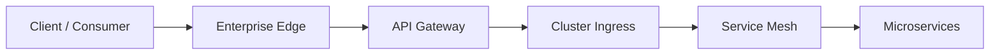
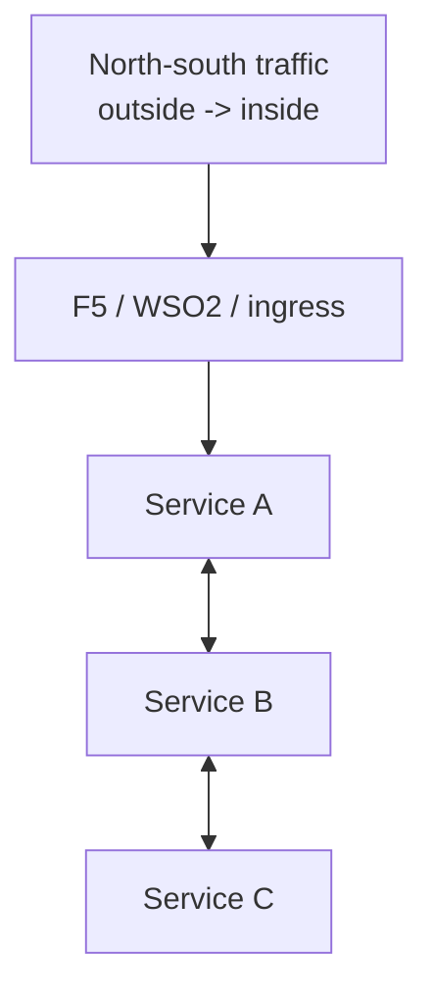

# 1. Core Concepts

This article explains the roles of each layer before comparing patterns.

## The four major layers

In your setup, there are usually four traffic-control layers:

- enterprise edge
- API governance layer
- cluster ingress layer
- service mesh layer

## Layered traffic model

## What each component is for

### F5

F5 usually owns:

- public VIPs
- public DNS endpoints
- WAF
- edge TLS posture
- external load balancing
- DDoS protections

### WSO2 API Gateway

WSO2 usually owns:

- API exposure
- OAuth and token validation
- subscription and throttling
- API products
- developer portal concerns
- request mediation or transformation

### OpenShift ingress objects

OpenShift usually provides:

- Routes
- Ingress or Gateway API resources
- internal cluster exposure patterns

This is the cluster-native entry mechanism, but not always the enterprise edge.

### Istio

Istio usually owns:

- service-to-service security
- mesh mTLS
- workload identity
- in-mesh traffic policy
- observability
- service-level ingress and routing policy

## North-south versus east-west

This distinction is essential.

- `North-south` means traffic coming into the platform from users or external systems
- `East-west` means traffic between services inside the platform

## Clean ownership model

The cleanest designs give each layer one primary job.

| Layer | Primary owner | Main concern |
|---|---|---|
| Edge | F5 | public exposure and perimeter security |
| API | WSO2 | API governance and consumer policy |
| Cluster ingress | Istio ingress or Gateway API | entry into the service platform |
| Mesh | Istio | service identity, mTLS, routing, telemetry |

## What causes messy architectures

Architectures get messy when the same responsibility appears in multiple places:

- TLS terminated in too many layers without clear reason
- API policy duplicated in WSO2 and Istio
- public traffic enters through both F5 and random OpenShift Routes
- some services go through mesh and others bypass it

## A simple way to explain this to stakeholders

Use this sentence:

"The edge should protect the enterprise, the API gateway should protect and manage APIs, and the mesh should protect and control service-to-service communication."
