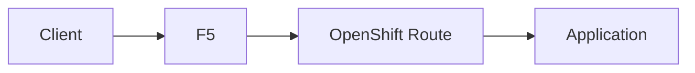
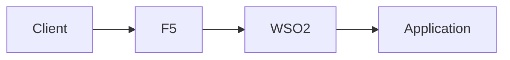
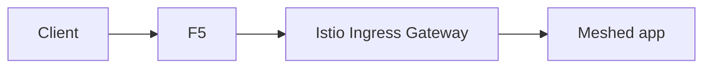
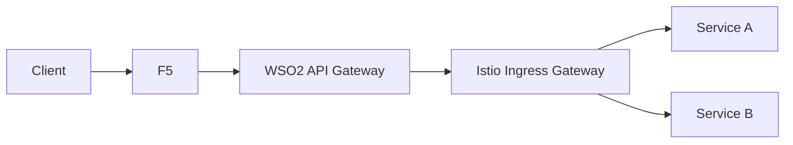
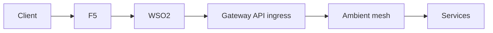

# 2. Pattern Catalog

This article shows the main architecture options before recommending one.

## Pattern A: F5 directly to OpenShift Route

### Good for

- simple apps
- non-API-managed services
- low-complexity exposure

### Weaknesses

- bypasses API gateway controls
- weak for enterprise API governance
- creates inconsistency if some apps go through WSO2 and some do not

## Pattern B: F5 to WSO2 to app directly

### Good for

- simple API gateway-centric environments
- non-mesh platforms

### Weaknesses

- bypasses Istio ingress and mesh policy
- weakens service-mesh observability and consistency

## Pattern C: F5 to Istio ingress to app

### Good for

- internal platforms without dedicated API management
- service-mesh-first organizations

### Weaknesses

- not enough when you need a full API product and policy layer
- pushes API concerns into the mesh

## Pattern D: F5 to WSO2 to Istio ingress to apps

### Good for

- enterprise environments
- strong API governance needs
- service mesh inside the platform
- clean separation of responsibilities

### Weaknesses

- more layers to operate
- requires clear ownership boundaries

## Pattern E: F5 to WSO2 to Gateway API ingress to ambient mesh

### Good for

- OpenShift Service Mesh 3 ambient deployments
- orgs standardizing on Gateway API

### Weaknesses

- ambient model changes troubleshooting
- requires stronger platform maturity

## Comparison table

| Pattern | Best for | Main risk |
|---|---|---|
| F5 -> Route -> app | simple direct exposure | fragmented governance |
| F5 -> WSO2 -> app | API-centric non-mesh | bypasses mesh benefits |
| F5 -> Istio -> app | mesh-first exposure | limited API governance |
| F5 -> WSO2 -> Istio -> app | enterprise API + mesh | more architecture layers |
| F5 -> WSO2 -> Gateway API -> ambient | modern ambient mode | newer operating model |
