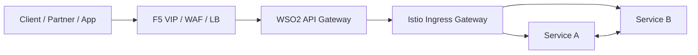
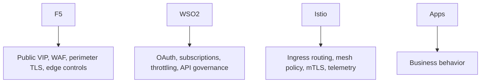
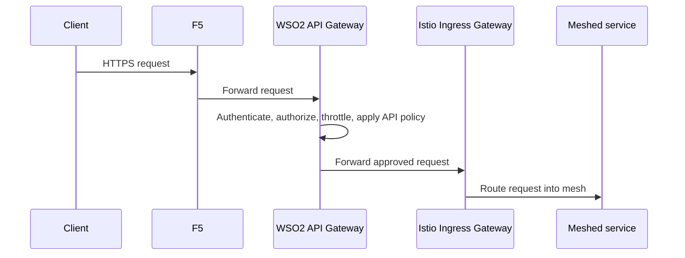

# 3. Recommended Pattern: F5 -> WSO2 -> Istio -> Services

This is the cleanest pattern for most enterprise platforms where F5 is mandatory, WSO2 is the API gateway, and applications are inside Istio.

## Recommended architecture

## Why this pattern is clean

Each component has one primary job:

- `F5` is the enterprise edge
- `WSO2` is the API policy and consumer control layer
- `Istio` is the cluster ingress and service mesh control layer
- `Services` only implement business logic

## Ownership map

## Request flow

## What this gives you

- clean external hostname ownership
- centralized API governance
- preserved mesh security
- easier service consistency
- no need for apps to be directly public

## Good DNS pattern

Use DNS names like:

- `api.company.com` to F5
- internal forwarding from F5 to WSO2
- internal forwarding from WSO2 to Istio ingress

Do not expose every microservice with its own public Route unless that is an intentional design.

## Good policy rule

If WSO2 owns the API contract, then Istio should not duplicate WSO2-style API product logic.

Istio should instead focus on:

- routing to the right backend
- service-level authorization
- mesh observability
- mTLS and workload identity
