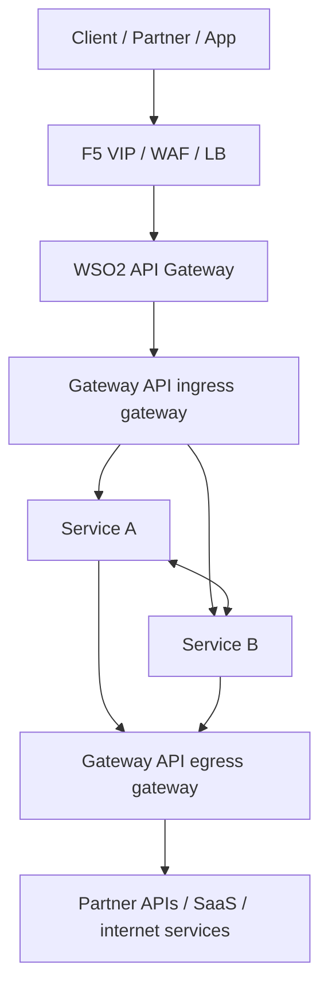
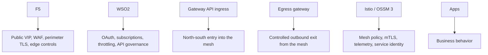
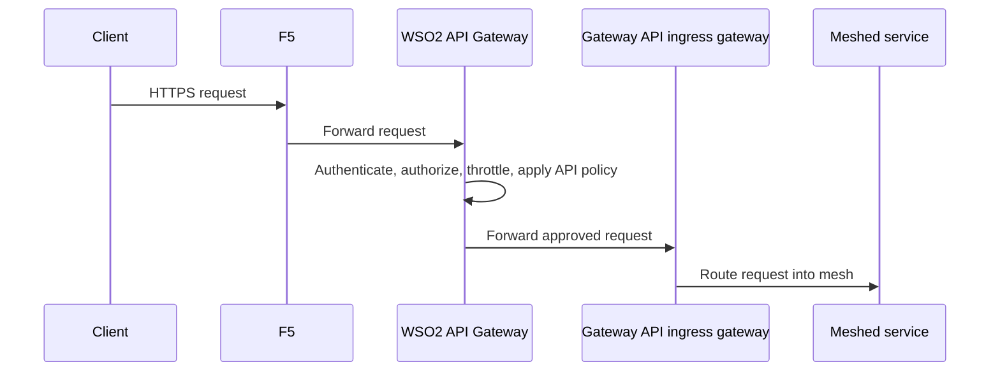
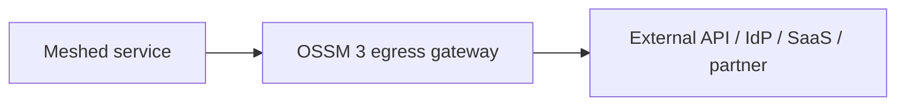

# 3. Recommended Pattern: F5 -> WSO2 -> OSSM 3 Gateway API -> Services

This is the cleanest pattern for most enterprise platforms where F5 is mandatory, WSO2 is the API gateway, applications run inside OpenShift Service Mesh 3, Vault is the PKI and KV system, and outbound traffic should leave through a controlled egress path.

## Recommended architecture

## Why this pattern is clean

Each component has one primary job:

- `F5` is the enterprise edge
- `WSO2` is the API policy and consumer control layer
- `OSSM 3 Gateway API ingress` is the cluster entry layer
- `OSSM 3 egress gateway` is the controlled outbound layer
- `Istio` is the service mesh control layer
- `Services` only implement business logic

## Ownership map

## Request flow

## What this gives you

- clean external hostname ownership
- centralized API governance
- preserved mesh security
- controlled outbound traffic path
- easier service consistency
- no need for apps to be directly public

## Good DNS pattern

Use DNS names like:

- `api.company.com` to F5
- internal forwarding from F5 to WSO2
- internal forwarding from WSO2 to Gateway API ingress

Do not expose every microservice with its own public Route unless that is an intentional design.

## Good policy rule

If WSO2 owns the API contract, then Istio should not duplicate WSO2-style API product logic.

Istio should instead focus on:

- routing to the right backend
- service-level authorization
- mesh observability
- mTLS and workload identity

## Outbound pattern

For external calls from the mesh, use a controlled egress path:

This gives you:

- auditable outbound connectivity
- allow-list based external access
- centralized outbound monitoring
- clearer security review for internet-bound traffic
