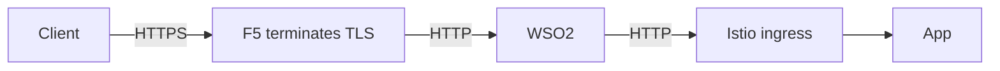
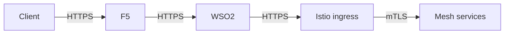
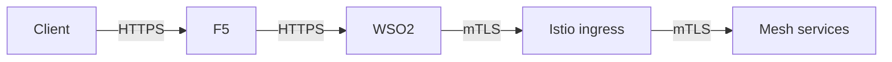
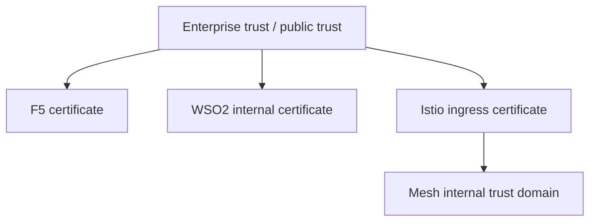

# 4. TLS Termination And Trust Models

This article explains the main TLS patterns across F5, WSO2, and Istio.

## Pattern 1: TLS terminated only at F5

### Benefit

- simplest edge configuration

### Risk

- no encryption after the edge
- not appropriate for most regulated or security-conscious environments

## Pattern 2: TLS re-encryption from F5 onward

### Benefit

- strong end-to-end security posture across layers

### Cost

- more certificate management

## Pattern 3: mTLS from WSO2 to Istio ingress

### Benefit

- very strong trust boundary between API gateway and cluster ingress

### Good use case

- high-security enterprise environments
- internal zero-trust posture

## Recommended practical model

For most enterprise setups:

- `Client -> F5`: HTTPS
- `F5 -> WSO2`: HTTPS re-encryption
- `WSO2 -> Istio ingress`: TLS or mTLS
- `Istio internal`: mesh mTLS

## Trust chain model

## What Vault and cert-manager typically manage

In a modern platform:

- `Vault + cert-manager` can issue and renew Istio ingress gateway certs
- mesh workload identity is still typically handled by Istio CA
- WSO2 certificates may be managed separately or through the same PKI program

## Clean TLS principle

Do not let TLS become accidental.

Decide explicitly:

- where TLS terminates
- where it is re-encrypted
- where mTLS is required
- which CA issues which certificates
