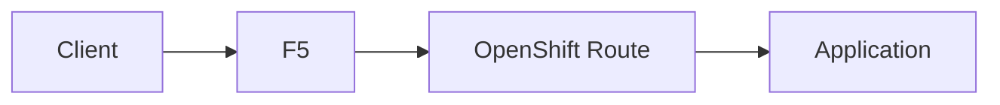
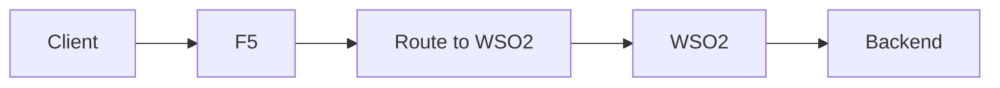
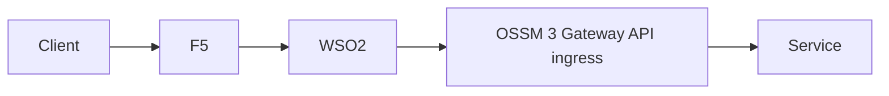
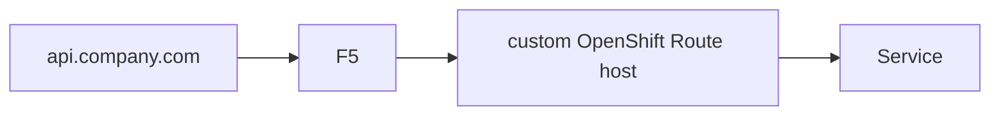
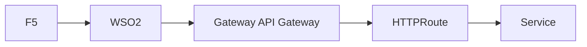

# 5. OpenShift Routes, Gateway API, And Ingress

This article explains how OpenShift-native exposure fits with F5, WSO2, and **OpenShift Service Mesh 3** when **Gateway API** is your default ingress model.

## The main problem

OpenShift gives you Routes and ingress options, but in your target model enterprise traffic already enters through F5 and WSO2 and then reaches the cluster through Gateway API ingress.

That means you need to decide whether OpenShift-native entry is:

- the main public entry
- an internal platform entry
- just a technical implementation detail

## Common models

### Model A: Route as primary entry

This is usually only clean for simple non-API-governed applications and is not the default for your target architecture.

### Model B: Route to WSO2

This can work, but it often creates redundant public-entry modeling if F5 already owns the edge.

### Model C: F5 and WSO2 remain primary, Gateway API ingress stays internal and preferred

This is the default enterprise pattern for these updated docs.

## When Routes are still useful

Routes are still useful for:

- internal cluster integration
- admin endpoints
- quick non-production exposure
- technical plumbing where needed

But they should not automatically become the enterprise public entry layer in this architecture.

## Custom names

You can use custom hostnames instead of messy generated Route names.

To do this cleanly:

- the DNS hostname must point to the correct external entry point
- the route or gateway hostname must match
- the certificate must match the hostname

## Gateway API direction

In OpenShift Service Mesh 3, Gateway API is the preferred model to standardize ingress and egress behavior, especially if you want one Kubernetes-native model across both classic and ambient deployments.

## Decision rule

Use OpenShift Routes as the primary public abstraction only when:

- the platform is simple
- you do not need a separate enterprise API gateway pattern
- F5 and WSO2 are not intended to be the main governing layers

For your target design, Routes are secondary and Gateway API ingress is primary.
