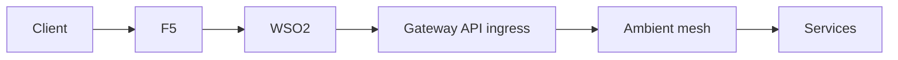
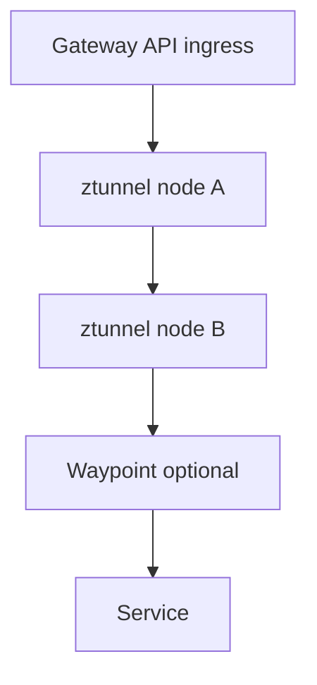
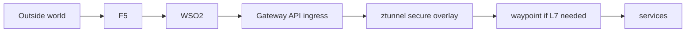

# 6. Ambient Mode Patterns

This article explains how the gateway architecture changes if you use OpenShift Service Mesh 3 ambient mode.

## The key difference

The north-south architecture may stay mostly the same, but the in-cluster data plane changes.

In classic mode:

- ingress goes to sidecar-based mesh services

In ambient mode:

- ingress goes into the ambient secure overlay
- `ztunnel` handles L4 secure transport
- `waypoint` handles L7 features where needed

## Recommended ambient pattern

## In-cluster ambient view

## Why this stays clean

The responsibility split does not need to change:

- `F5` still owns edge posture
- `WSO2` still owns API policy
- `Gateway API ingress` still owns cluster entry
- `Ambient mesh` still owns service security

## Ambient caution

Do not redesign the whole edge just because the mesh went ambient.

Ambient mode changes:

- internal traffic path
- mesh enforcement points
- some ingress configuration guidance

It does not automatically change:

- enterprise edge ownership
- API governance ownership
- DNS ownership

## Good way to explain it

