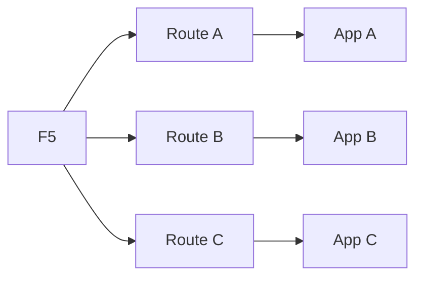
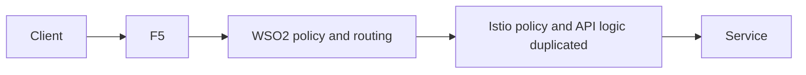
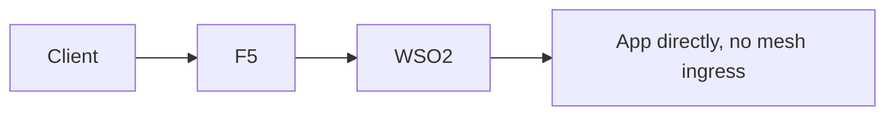

# 7. Anti-Patterns And Decision Guide

This article explains what to avoid and how to choose the right model.

## Anti-pattern 1: every team exposes its own Route



Why it is bad:

- fragmented governance
- inconsistent TLS
- hard-to-track exposure

## Anti-pattern 2: WSO2 and Istio both act as full API gateways



Why it is bad:

- duplicated policy
- unclear ownership
- harder troubleshooting

## Anti-pattern 3: bypassing the mesh for convenience



Why it is bad:

- loses mesh consistency
- weakens observability and policy alignment

## Decision guide

### If you need strong enterprise API governance

Choose:

```text
F5 -> WSO2 -> Istio ingress -> services
```

### If you need simple app exposure only

Choose:

```text
F5 -> Route -> app
```

But only for low-complexity cases.

### If you are standardizing on ambient mode

Choose:

```text
F5 -> WSO2 -> Gateway API ingress -> ambient mesh services
```

## Final recommendation matrix

| Need | Recommended pattern |
|---|---|
| enterprise edge + API governance + mesh | F5 -> WSO2 -> Istio ingress -> mesh |
| simple exposure | F5 -> Route -> app |
| mesh-first without API product layer | F5 -> Istio ingress -> app |
| ambient mode | F5 -> WSO2 -> Gateway API ingress -> ambient mesh |

## Final architecture rule

Use this rule to keep designs clean:

- one edge owner
- one API owner
- one mesh owner
- one ingress model per platform pattern
