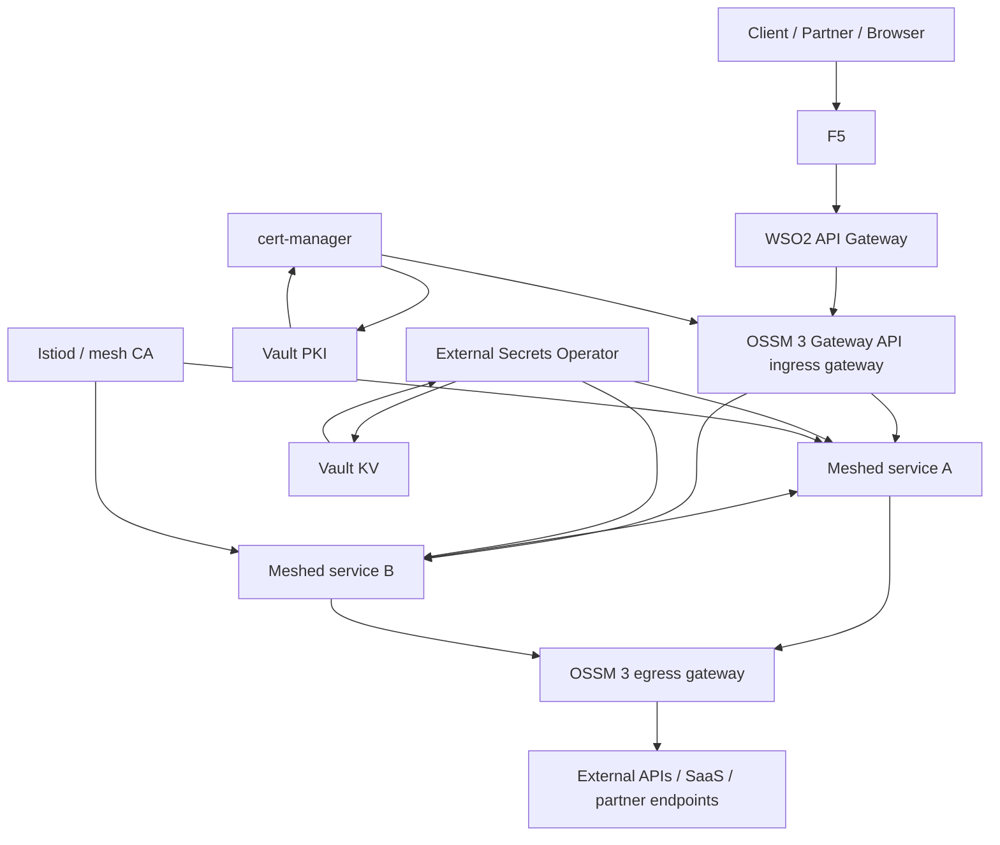
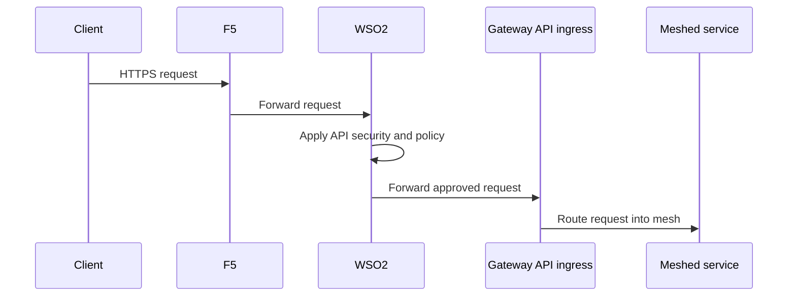
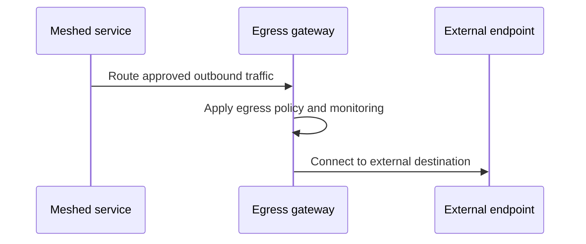
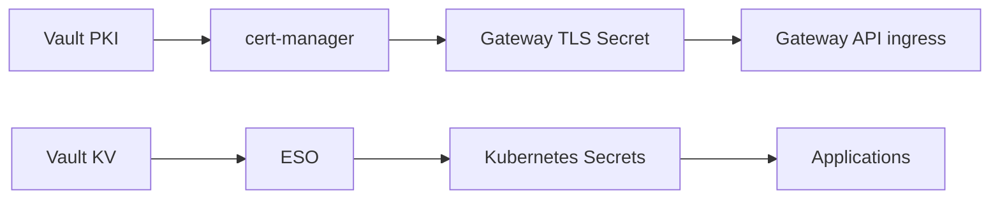

# 8. OSSM 3 Gateway API And Egress Reference

This article is the reference architecture for the exact target model used in the updated docs:

- OpenShift
- Red Hat OpenShift Service Mesh 3
- Vault as PKI and KV
- cert-manager for certificate automation
- External Secrets Operator for Vault KV sync
- Gateway API for ingress
- egress gateway for outbound traffic

## Reference architecture

## Core rules

1. Use **Gateway API ingress** as the default north-south entry into the cluster.
2. Use **egress gateway** for outbound traffic that must be governed or audited.
3. Use **Vault PKI** for ingress certificates managed through cert-manager.
4. Use **Vault KV** for application secrets synced through ESO.
5. Keep ingress and egress gateways in namespaces separate from the OSSM control plane namespace.

## Inbound flow

## Outbound flow

## PKI and secret flows

## Why this model is clean

- public edge ownership is clear
- API ownership is clear
- cluster ingress is standardized on Gateway API
- outbound traffic is centralized through egress
- certificate and secret lifecycles are separated cleanly

## Platform notes

The current Red Hat guidance that matters most here is:

- OSSM 3 does not auto-deploy gateways as part of the control plane
- ingress and egress gateways should be deployed separately from the control plane namespace
- Gateway API is fully supported in ambient mode and can also be used for sidecar-based deployments
- egress in ambient mode should use Gateway API instead of Istio `Gateway` and `VirtualService`

## Suggested references

- [Red Hat OpenShift Service Mesh 3.3 gateways](https://docs.redhat.com/en/documentation/red_hat_openshift_service_mesh/3.3/html-single/gateways/index)
- [Red Hat OpenShift Service Mesh 3.3 installing](https://docs.redhat.com/en/documentation/red_hat_openshift_service_mesh/3.3/html-single/installing/index)
- [Istio Gateway API docs](https://istio.io/latest/docs/tasks/traffic-management/ingress/gateway-api/)
- [Istio egress gateway docs](https://istio.io/latest/docs/tasks/traffic-management/egress/egress-gateway/)
