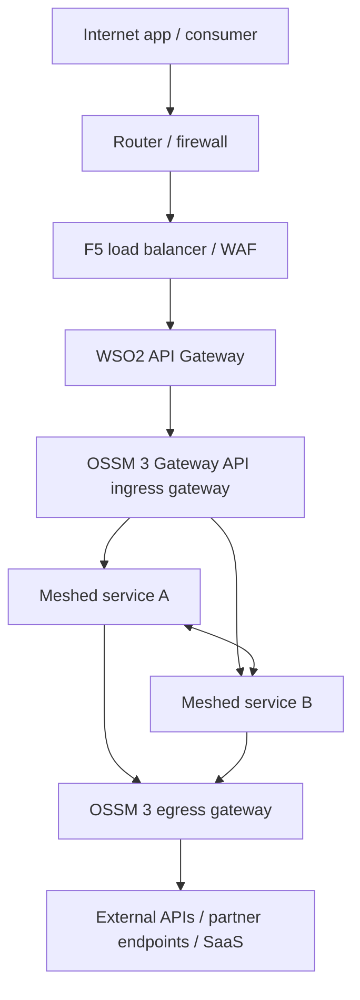
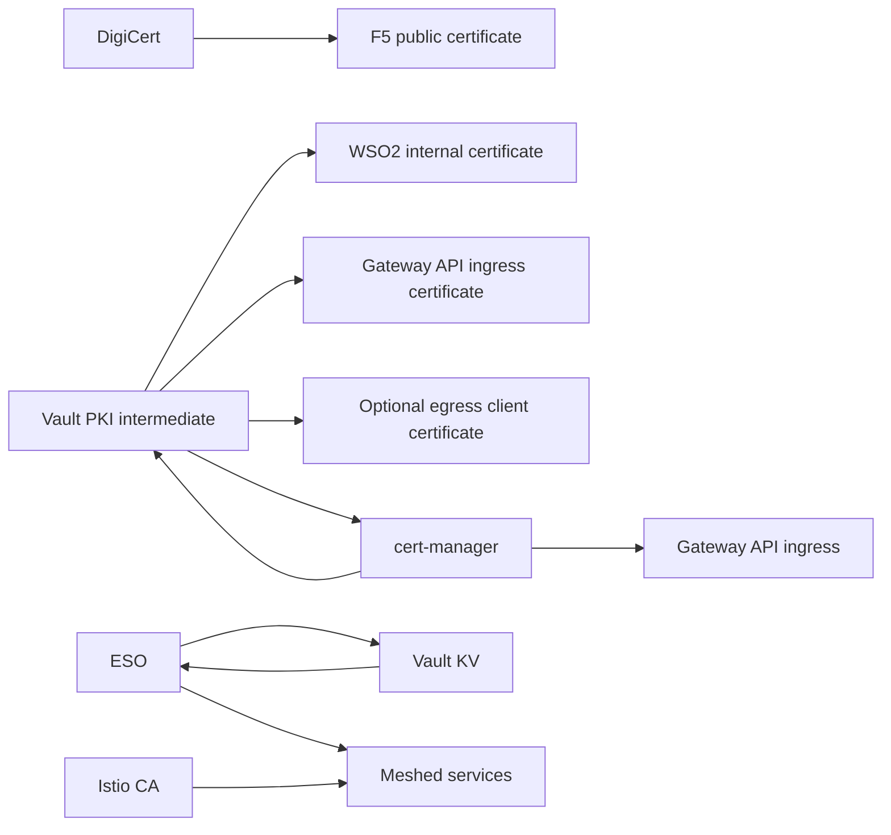
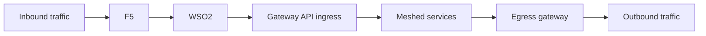

# 1. Target Architecture

This article describes the exact target architecture for your platform.

## End-to-end topology

## Component responsibilities

| Component | Responsibility |
|---|---|
| Router / firewall | perimeter network filtering and path to enterprise edge |
| F5 | public VIPs, WAF, public TLS, edge protections |
| WSO2 | API governance, OAuth, throttling, subscriptions, API security |
| OSSM 3 Gateway API ingress | north-south entry into the cluster |
| OSSM 3 service mesh | service identity, mTLS, mesh routing, telemetry |
| OSSM 3 egress gateway | controlled outbound exit from the mesh |
| Vault PKI | internal TLS certificate issuance |
| Vault KV | application secrets |
| cert-manager | automated certificate request and renewal |
| ESO | Vault KV synchronization into Kubernetes Secrets |

## Why this is the clean pattern

This pattern works well because every layer has a clear role:

- internet-facing trust is separate from internal platform trust
- API policy is separate from mesh policy
- ingress and egress are explicit
- platform TLS and mesh mTLS are separate concerns

## Reference architecture with PKI and secrets

## Inbound and outbound view together

