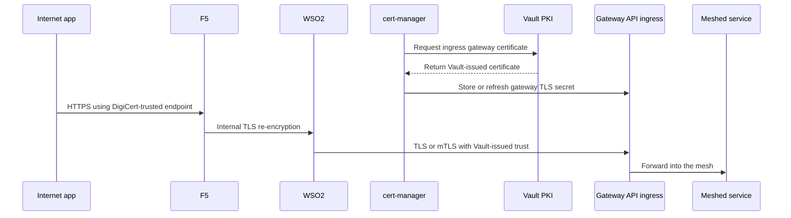
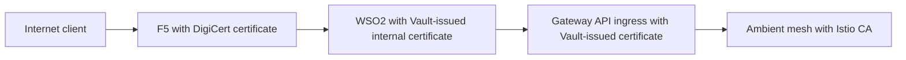
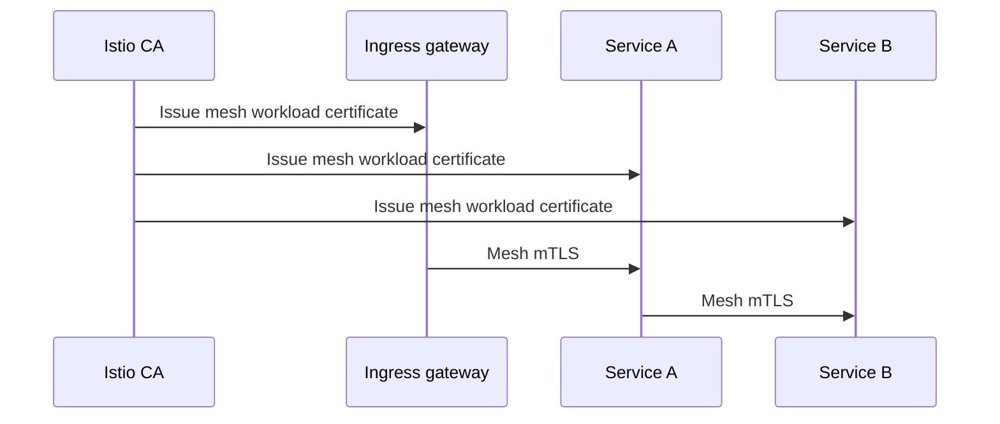
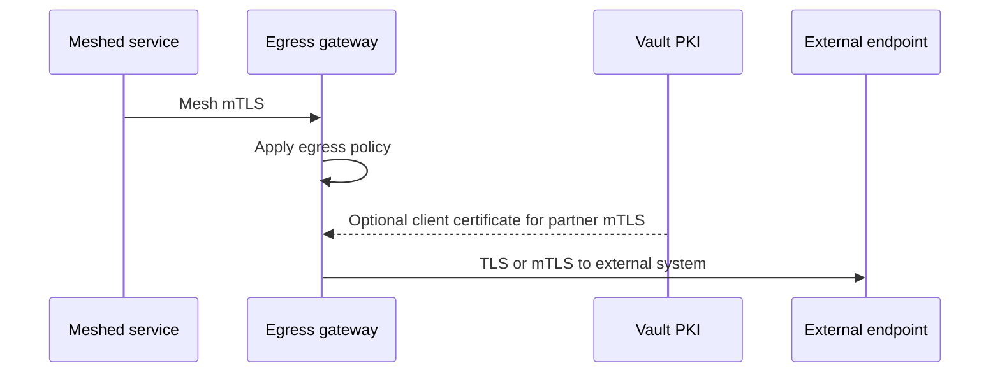
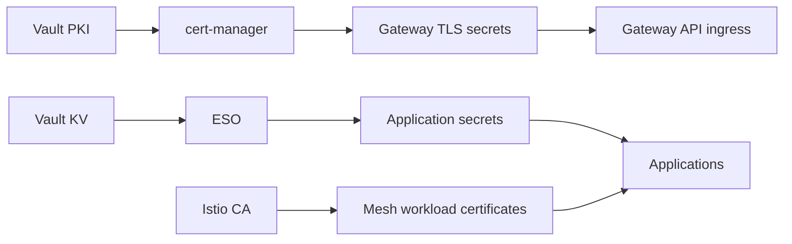

# 2. Certificate Flows

This article explains the inbound, north-south, east-west, and outbound certificate flows.

## Trust domains

Use three distinct trust domains:

| Trust domain | Issuer | Purpose |
|---|---|---|
| Public edge trust | DigiCert | public internet-facing endpoint on F5 |
| Internal platform trust | Vault PKI | WSO2 internal certs, Gateway API ingress certs, optional partner mTLS certs |
| Mesh runtime trust | Istio CA | ingress-to-service and service-to-service mTLS inside the mesh |

## Inbound north-south certificate flow

### Step-by-step

1. The internet client connects to F5 using a public hostname.
2. F5 presents a `DigiCert`-issued certificate.
3. F5 forwards traffic to WSO2 over internal TLS.
4. WSO2 presents a `Vault PKI`-issued certificate.
5. WSO2 forwards traffic to the OSSM 3 Gateway API ingress gateway using TLS or mTLS.
6. The ingress gateway presents a `Vault PKI`-issued certificate managed by `cert-manager`.
7. Once traffic enters the mesh, `Istio CA`-issued workload identity is used for mesh mTLS.

## WSO2 certificate recommendation

For this architecture, the cleanest recommendation is:

- use a `DigiCert` certificate only on `F5` for the public internet-facing endpoint
- use a `Vault PKI`-issued certificate on `WSO2` for its internal-facing TLS endpoint
- use a `Vault PKI`-issued certificate on the `Gateway API ingress` listener
- use `Istio CA` only for in-mesh workload identity and mTLS

### Why this is the best split

This keeps the trust domains clean:

- `F5` handles public trust
- `WSO2` and `Gateway API ingress` participate in internal platform trust
- `Istio` handles service-to-service runtime trust

### Recommended WSO2 pattern

### When this recommendation is especially strong

Use a Vault-issued WSO2 certificate when:

- WSO2 is not directly exposed as the public internet endpoint
- F5 is the real enterprise edge
- you want one internal PKI model across middleware and gateways
- you want controlled renewal and issuance policy

### When you might choose differently

You might choose a different certificate source only if:

- WSO2 itself must directly serve internet clients and therefore needs public-trust TLS
- your enterprise mandates a different internal PKI for middleware certificates

### Practical recommendation

In your current design, the default should be:

- `Client -> F5`: DigiCert
- `F5 -> WSO2`: Vault-issued internal TLS
- `WSO2 -> Gateway API ingress`: Vault-issued TLS or mTLS
- `Inside mesh`: Istio CA mTLS

## East-west certificate flow

Inside the mesh, keep the PKI model simple:

- `Istio CA` issues short-lived workload certificates
- workloads authenticate each other using mesh identity
- the ingress gateway also participates in mesh identity when calling services

## Outbound certificate flow

For outbound traffic:

1. The service talks to the egress gateway using mesh mTLS.
2. The egress gateway evaluates policy and monitoring rules.
3. The egress gateway connects to the external target using:
   - standard public TLS validation for internet APIs, or
   - client-certificate mTLS using a `Vault PKI`-issued certificate for partner or B2B endpoints

## Secret flow versus certificate flow

Certificates and secrets should stay operationally separate.

## Best-practice summary

- use `DigiCert` at the public edge only
- use `Vault PKI` for internal platform TLS endpoints
- use `Istio CA` for mesh mTLS only
- use `Vault KV` for non-certificate secrets
