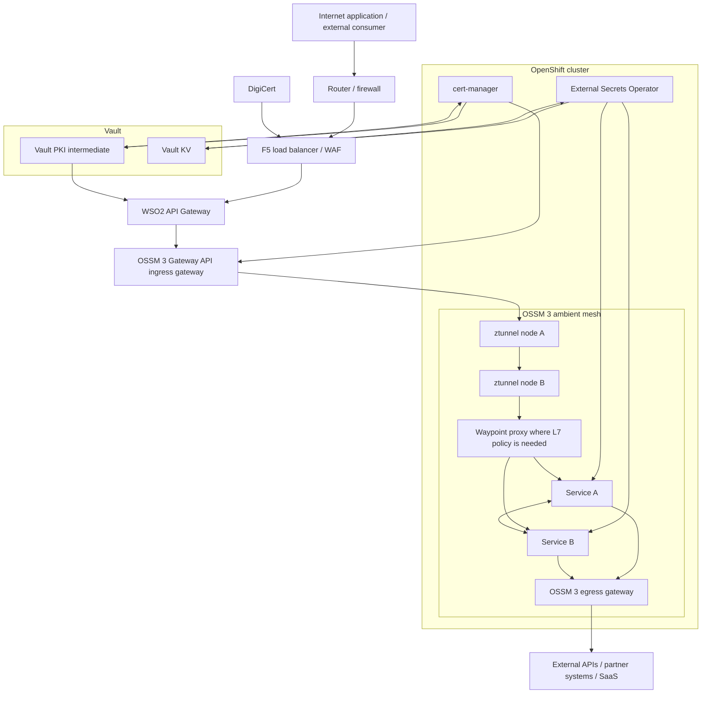
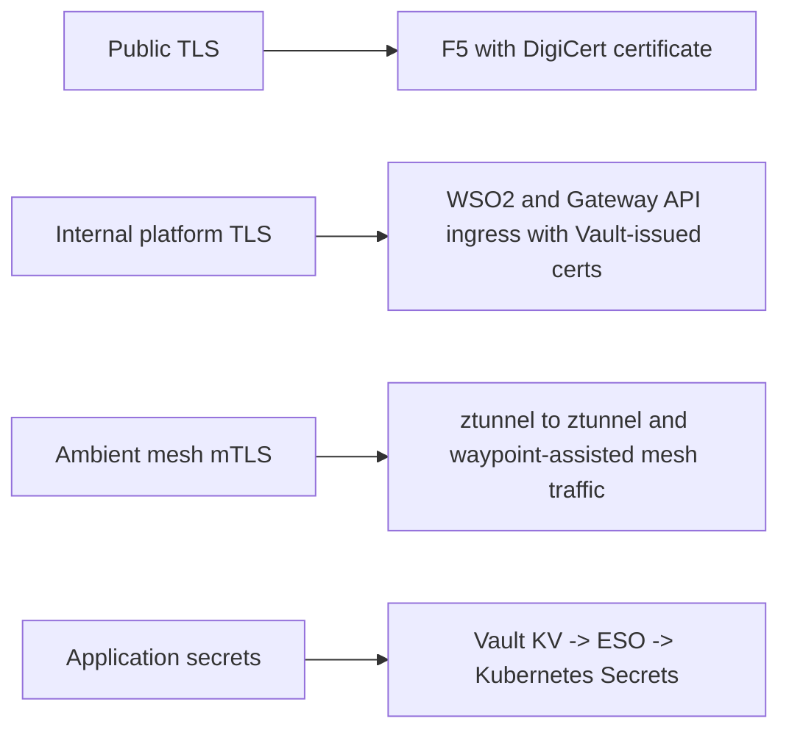
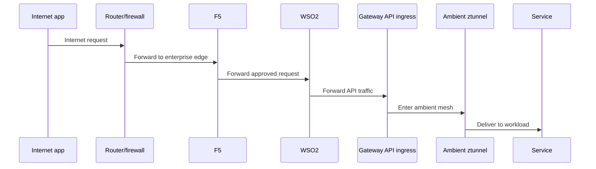
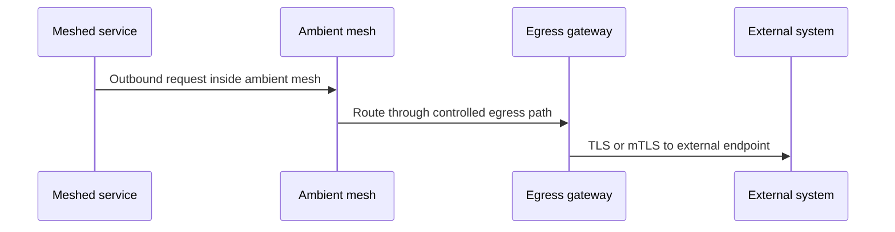

# 2. Implementation Diagram

This page gives a single implementation diagram for the target architecture using:

- OpenShift
- OpenShift Service Mesh 3 ambient mode
- Gateway API ingress
- egress gateway
- F5
- WSO2
- Vault PKI and KV
- DigiCert for public trust

## End-to-end implementation diagram

## Trust and traffic overlays

## Inbound path

## Outbound path

## Certificate ownership summary

| Segment | Certificate source |
|---|---|
| Internet client to F5 | DigiCert |
| F5 to WSO2 | Vault PKI or enterprise internal PKI |
| WSO2 to Gateway API ingress | Vault PKI |
| Ambient mesh service-to-service | Istio CA |
| Egress client certificate when needed | Vault PKI |

## Design note

This implementation keeps the responsibilities clean:

- `F5` owns edge exposure
- `WSO2` owns API governance
- `Gateway API ingress` owns cluster entry
- `ambient mesh` owns service-to-service trust
- `egress gateway` owns controlled outbound access
- `Vault` owns internal PKI and secret storage
