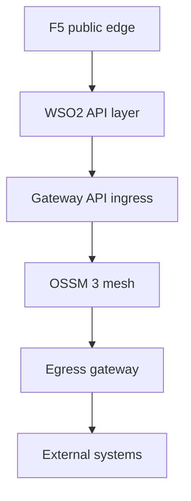
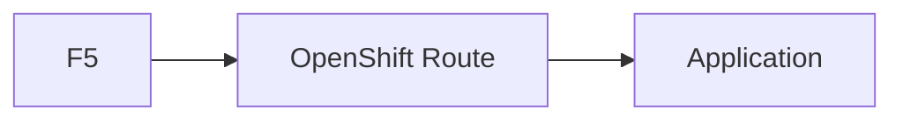
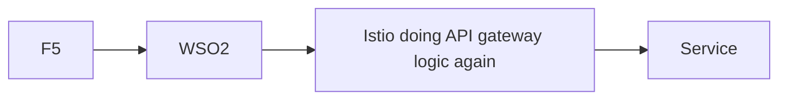

# 3. Implementation Principles

This article turns the target architecture into practical platform rules.

## Core design rules

1. Use `Gateway API` as the default ingress model in OpenShift Service Mesh 3.
2. Use an `egress gateway` for outbound flows that require audit, control, or allow-listing.
3. Do not use OpenShift Routes as the primary public architecture for these APIs.
4. Keep `Vault PKI`, `Vault KV`, and `Istio CA` as distinct trust domains.
5. Keep ingress and egress gateway deployments outside the OSSM control-plane namespace.

## Clean implementation model

## What to avoid

### Avoid Route-first public design

Why to avoid it:

- bypasses the intended API governance layer
- fragments ingress architecture
- makes policy ownership less clear

### Avoid duplicated gateway ownership

Why to avoid it:

- duplicates routing and policy logic
- makes troubleshooting harder
- weakens clean architectural boundaries

## Final implementation statement

Use this sentence in your design document:

"Internet-facing trust terminates at F5 with DigiCert, API governance is enforced at WSO2, cluster entry is standardized on OpenShift Service Mesh 3 Gateway API ingress, service-to-service communication is protected by Istio CA mTLS, internal platform certificates come from Vault PKI, application secrets come from Vault KV, and outbound access is controlled through an OSSM 3 egress gateway."
