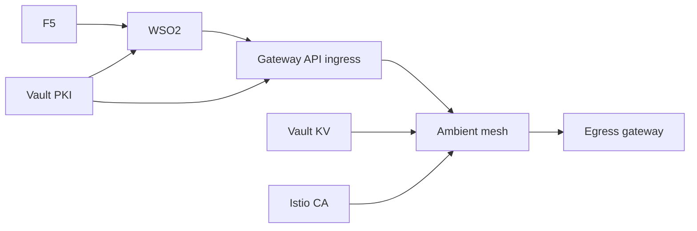
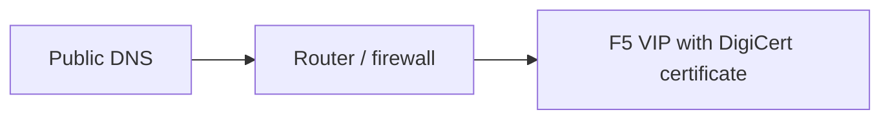
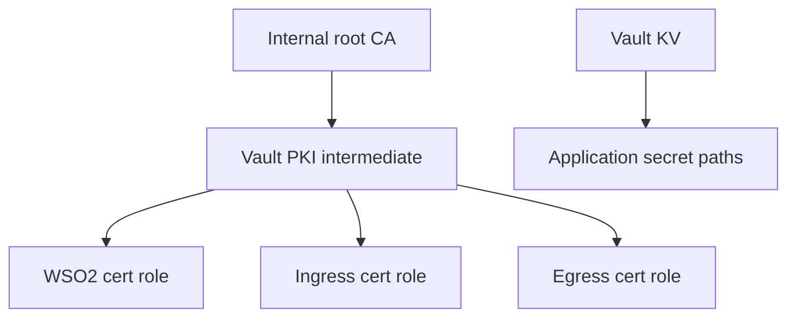
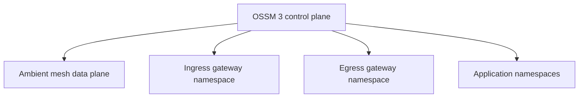
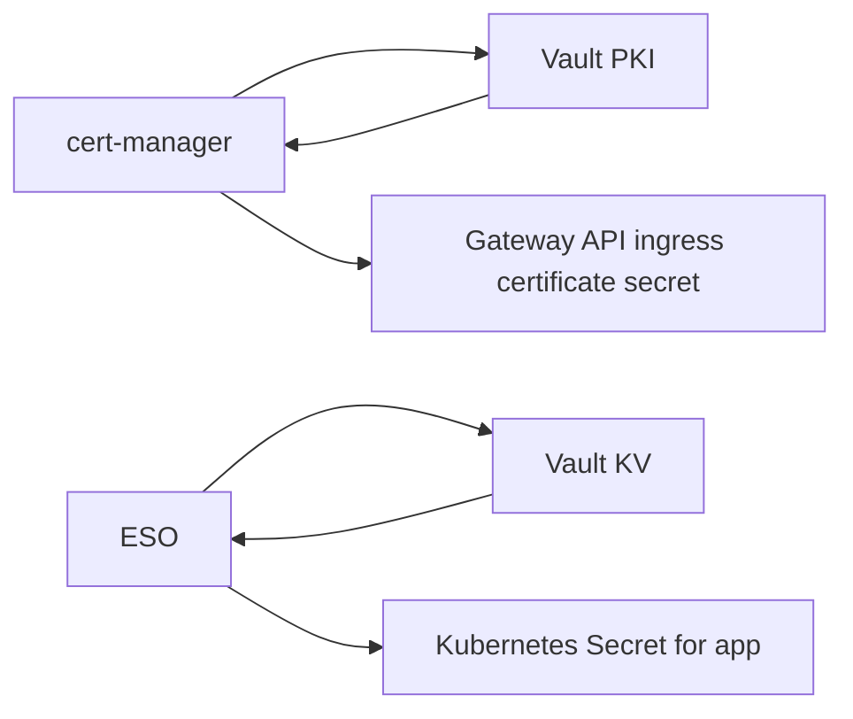
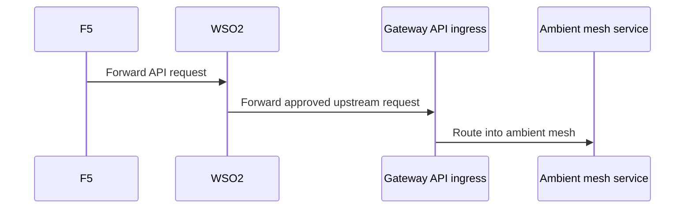
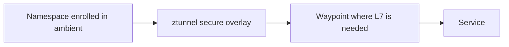
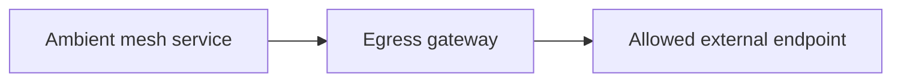
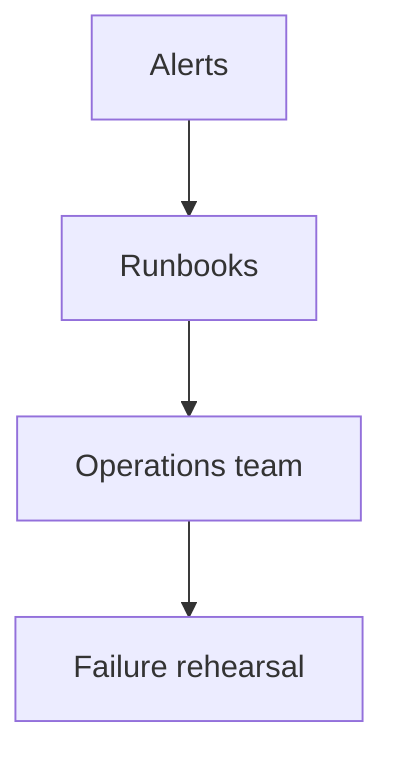

# 5. Phase-Wise Guideline

This guide gives a practical rollout sequence for implementing the target architecture safely in production.

The target state is:

```text
Inbound:  Internet app -> router -> F5 -> WSO2 -> OSSM 3 Gateway API ingress -> ambient mesh services
Outbound: ambient mesh services -> OSSM 3 egress gateway -> external systems
```

## Delivery strategy

Do not try to switch everything at once.

A safer program is:

1. Build the trust foundations
2. Build the platform foundations
3. Expose one path end to end
4. Onboard services incrementally
5. Lock down outbound traffic
6. Harden, observe, and rehearse failure scenarios

## Phase 0: Architecture And Ownership

### Goal

Agree on the ownership model and the trust boundaries before implementation starts.

### Outcomes

- F5 owns the internet-facing edge
- WSO2 owns API governance
- OSSM 3 Gateway API ingress owns cluster entry
- OSSM 3 egress gateway owns governed outbound traffic
- Vault PKI owns internal platform certificate issuance
- Vault KV owns application secrets
- Istio CA owns mesh mTLS

### Deliverables

- approved architecture diagram
- hostname inventory
- trust-domain inventory
- gateway namespace plan
- environment list for dev, test, pre-prod, prod



## Phase 1: DNS, Public Edge, And Public Certificates

### Goal

Make the public entry clean and predictable before integrating the cluster.

### Tasks

- define public DNS names
- point public DNS to F5 VIPs
- install DigiCert certificates on F5
- validate router/firewall path to F5
- confirm WAF and edge policies

### Example outputs

- `api.company.com`
- `partner-api.company.com`

### Exit criteria

- internet clients can reach F5 using the final public hostnames
- DigiCert certificate chain validates cleanly



## Phase 2: Vault PKI And Vault KV Foundations

### Goal

Stand up internal trust and secret storage before onboarding mesh gateways and workloads.

### Tasks

- define offline root or enterprise internal root relationship
- configure Vault PKI intermediate
- define PKI roles for:
  - WSO2 internal certificates
  - Gateway API ingress certificates
  - optional egress client certificates
- configure Vault KV layout for application secrets
- define Kubernetes auth roles and policies

### Suggested PKI roles

- `role-wso2-internal`
- `role-gateway-api-ingress`
- `role-egress-client`

### Exit criteria

- Vault can issue internal TLS certs
- Vault KV paths are policy-protected
- controller service accounts can authenticate to Vault



## Phase 3: OpenShift And OSSM 3 Base Platform

### Goal

Prepare the cluster and service mesh foundation before application exposure.

### Tasks

- install OpenShift Service Mesh 3
- enable ambient mode if this is your target operating model
- confirm required Gateway API CRDs are present
- create dedicated namespaces for:
  - ingress gateway
  - egress gateway
  - applications
- avoid deploying gateways in the OSSM control-plane namespace

### Exit criteria

- OSSM 3 control plane is healthy
- ambient data plane is healthy
- gateway namespaces exist and are ready



## Phase 4: cert-manager And ESO Integration

### Goal

Automate certificate and secret delivery before exposing the application path.

### Tasks

- install cert-manager
- configure Vault issuer or ClusterIssuer for ingress certificates
- install External Secrets Operator
- configure Vault-backed SecretStore or ClusterSecretStore
- test one sample ingress certificate and one sample app secret

### Exit criteria

- ingress gateway certificate is issued automatically from Vault PKI
- application secret sync from Vault KV works



## Phase 5: Gateway API Ingress And WSO2 Integration

### Goal

Create the first real north-south path into the mesh.

### Tasks

- deploy Gateway API ingress gateway
- configure `Gateway` and `HTTPRoute` resources
- attach Vault-issued certificate to ingress listener
- configure WSO2 upstream to the ingress gateway
- validate hostnames and TLS between:
  - F5 and WSO2
  - WSO2 and ingress gateway
- onboard one non-critical service first

### Exit criteria

- one production-like API path works end to end
- request path is:
  `F5 -> WSO2 -> Gateway API ingress -> ambient mesh service`



## Phase 6: Ambient Mesh Service Onboarding

### Goal

Bring workloads into the ambient mesh gradually.

### Tasks

- label target namespaces for ambient mode
- validate ztunnel behavior
- introduce waypoint proxies only where L7 policy is required
- enforce service-to-service mTLS
- validate workload identity and authorization

### Exit criteria

- selected namespaces are inside the ambient mesh
- east-west traffic is encrypted and policy-controlled



## Phase 7: Egress Gateway Rollout

### Goal

Move governed outbound traffic through a controlled egress path.

### Tasks

- deploy OSSM 3 egress gateway
- define allowed outbound destinations
- route selected external traffic through egress gateway
- configure outbound TLS validation
- configure partner mTLS with Vault-issued client certs where needed

### Exit criteria

- selected external destinations are reachable only through egress
- egress observability and policy are working



## Phase 8: Security Hardening

### Goal

Reduce accidental exposure and lock the architecture to the intended model.

### Tasks

- remove or limit direct internet paths that bypass F5 or WSO2
- disable unnecessary public Routes
- tighten Vault policies
- require mTLS where justified between WSO2 and ingress
- harden gateway namespaces and RBAC
- validate certificate rotation windows

### Exit criteria

- bypass paths are closed
- trust boundaries are enforced
- certificate and secret lifecycle controls are working

## Phase 9: Observability, Runbooks, And Rehearsal

### Goal

Make the design operable, not just deployable.

### Tasks

- dashboards for ingress, ambient traffic, and egress
- alerts for certificate expiry
- alerts for Vault auth failures
- alerts for egress policy failures
- runbooks for:
  - F5 edge failure
  - WSO2 upstream failure
  - ingress certificate renewal failure
  - ambient mesh disruption
  - egress gateway failure

### Exit criteria

- on-call team can diagnose the main traffic paths
- failure drills have been rehearsed



## Recommended rollout order for environments

Use this sequence:

1. dev
2. integration or test
3. pre-production
4. production with one low-risk API
5. production broad rollout

## Final go-live checklist

- public DNS and DigiCert certs validated
- Vault PKI roles validated
- Vault KV secret sync validated
- Gateway API ingress validated
- ambient mesh onboarding validated
- egress gateway validated
- WSO2 to ingress TLS path validated
- service-to-service mTLS validated
- outbound policy validated
- monitoring and runbooks ready
