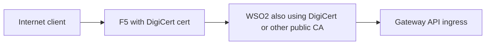
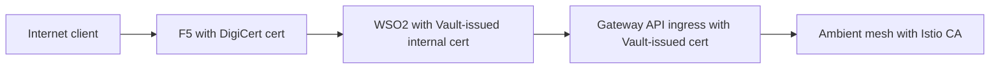
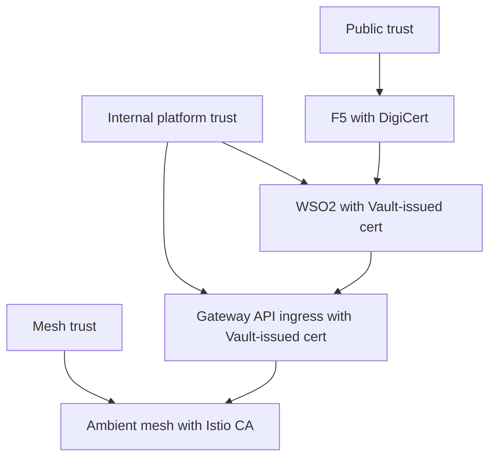
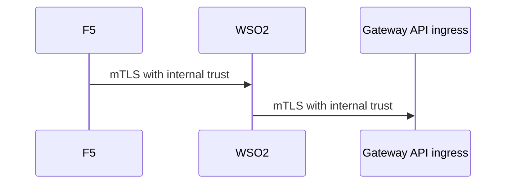

# 6. WSO2 Certificate Options

This article explains the two main certificate options for WSO2 API Gateway in your architecture:

1. public-trust certificate such as `DigiCert`
2. self-signed or internally trusted certificate using `Vault PKI` as the intermediate CA

The goal is to explain both options clearly and show which one is the better fit for your target design.

## Your target architecture

The target design is:

```text
Internet app -> router -> F5 -> WSO2 -> OSSM 3 Gateway API ingress -> ambient mesh services
```

That means:

- the internet client does not connect directly to WSO2 as the public edge
- `F5` is the public internet-facing endpoint
- WSO2 is an internal platform hop behind F5

## Option 1: WSO2 uses a DigiCert certificate

In this model, WSO2 presents a public-trust certificate, usually issued by DigiCert or another public CA.



### Advantages

- simple trust if many external tools must connect directly to WSO2
- easier interoperability if consumers outside your enterprise must trust WSO2 directly
- fewer internal trust-store changes in some environments

### Disadvantages

- public-trust certs are being used for an internal platform hop
- usually unnecessary if WSO2 is not the internet-facing endpoint
- can increase certificate cost and lifecycle complexity
- weakens the clean split between public trust and internal trust

### When this option makes sense

Use this only if:

- WSO2 itself is directly exposed to internet or partner clients
- external systems must independently validate WSO2 with public trust
- enterprise security policy explicitly requires public CA certificates there

## Option 2: WSO2 uses a Vault-issued internal certificate

In this model, WSO2 presents an internally trusted certificate issued from your internal PKI hierarchy, with Vault acting as the issuing intermediate.



### Advantages

- clean separation between public and internal trust
- consistent internal PKI for WSO2 and Gateway API ingress
- better control of issuance policy, TTL, rotation, and audit
- aligns well with Vault as the platform PKI system
- fits your architecture naturally because WSO2 is behind F5

### Disadvantages

- F5 and other internal consumers must trust your internal CA chain
- requires good PKI governance and trust distribution

### When this option makes sense

Use this when:

- F5 is the real public edge
- WSO2 is an internal platform component
- Vault is already the internal PKI source of truth
- you want a best-practice enterprise split between public trust and internal trust

## Recommended option for your design

For your architecture, the best-practice recommendation is:

- `F5` uses `DigiCert`
- `WSO2` uses a `Vault PKI`-issued internal certificate
- `Gateway API ingress` uses a `Vault PKI`-issued certificate
- `Istio CA` handles ambient mesh mTLS

## Why this recommendation is strongest

This gives you three clean trust domains:

| Trust domain | Certificate source | Used by |
|---|---|---|
| Public trust | DigiCert | F5 public endpoint |
| Internal platform trust | Vault PKI | WSO2 and Gateway API ingress |
| Mesh runtime trust | Istio CA | ambient mesh mTLS |

That split keeps each trust domain aligned to the audience it serves.

## Comparison table

| Question | DigiCert on WSO2 | Vault-issued cert on WSO2 |
|---|---|---|
| Best for public internet clients hitting WSO2 directly | Yes | No |
| Best for internal platform hop behind F5 | No | Yes |
| Clean separation of trust domains | No | Yes |
| Aligns with Vault as internal PKI | Partial | Yes |
| Best fit for your target architecture | No | Yes |

## End-to-end trust model



## mTLS variant between F5 and WSO2 or WSO2 and ingress

If you want stronger internal trust, you can go beyond server-side TLS:

- `F5 -> WSO2`: WSO2 presents a Vault-issued server cert, and F5 optionally presents a client cert if mutual auth is required
- `WSO2 -> Gateway API ingress`: ingress presents a Vault-issued server cert, and WSO2 optionally presents a Vault-issued client cert



## Final recommendation statement

Use this statement in your design document:

"Because F5 is the internet-facing edge, WSO2 should normally use an internally trusted certificate issued from Vault PKI rather than a public DigiCert certificate. Public trust should terminate at F5, internal platform trust should cover WSO2 and Gateway API ingress, and Istio CA should remain dedicated to ambient mesh mTLS."
