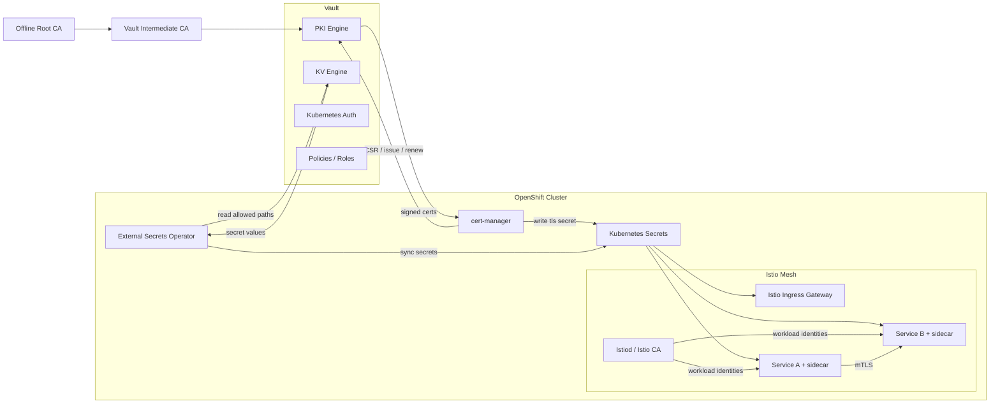
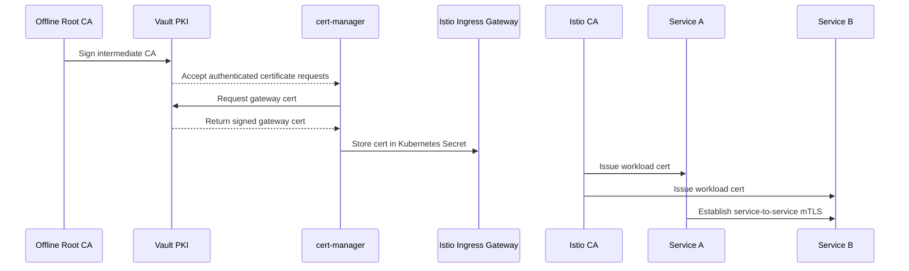

# 1. Architecture And Trust Model

This article explains the full trust model before we go into individual flows.

## The big picture

In this setup, OpenShift hosts the platform, Istio provides the service mesh, Vault provides centralized PKI and secret storage, cert-manager automates certificate requests, and External Secrets Operator syncs application secrets from Vault KV into Kubernetes.

The most important design decision is this:

- **Istio CA is responsible for internal mesh identity**
- **Vault PKI is responsible for selected platform-managed certificates, especially ingress and server certificates**
- **Vault KV is responsible for non-certificate application secrets**

## Logical architecture

## Trust boundaries

### 1. Offline root CA

The root CA is kept offline and should not be used to sign normal application certificates directly. Its role is to sign one or more intermediate CAs used by Vault.

### 2. Vault security boundary

Vault holds:

- intermediate CA private keys
- PKI roles and issuance policy
- KV secrets
- Kubernetes auth roles
- audit trail for sensitive operations

This is the platform trust anchor for issued certificates and stored secrets.

### 3. OpenShift platform boundary

OpenShift runs:

- workloads
- sidecars
- cert-manager
- ESO
- Istio control plane

OpenShift stores resulting TLS material and synced app secrets as Kubernetes Secrets, but it does not become the original authority for those values.

### 4. Mesh identity boundary

Inside Istio, each workload gets a short-lived identity certificate for service-to-service authentication. That identity is tied to the workload service account and workload namespace.

## Why people get confused

Teams often ask, "If Vault already issues certificates, why does Istio need its own CA?"

The answer is that the two systems solve different operational problems:

- Istio needs fast, automatic, short-lived workload identities for every meshed workload
- Vault provides centralized PKI governance and certificate issuance for selected use cases
- Using Vault for every internal sidecar-issued workload certificate usually adds complexity without improving the mesh operating model

## A clean responsibility matrix

| Function | Primary component | Why |
|---|---|---|
| Internal pod-to-pod mTLS | Istio CA | Native mesh identity and rotation |
| Public or north-south gateway certificate | Vault PKI via cert-manager | Controlled PKI policy and automated renewal |
| App passwords, API keys, tokens | Vault KV via ESO | Central secret storage and sync |
| Trust anchor governance | Offline Root CA | Controlled signing of intermediates |

## End-to-end trust story

## What to emphasize in the session

Say this clearly and repeatedly:

- The gateway certificate and the workload certificate are not the same certificate
- The client-facing TLS path and the service-to-service mTLS path are different security flows
- Vault, cert-manager, and Istio are cooperating, not duplicating each other
