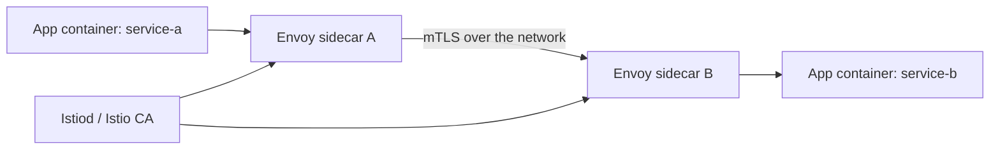
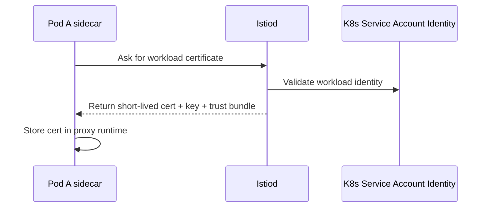
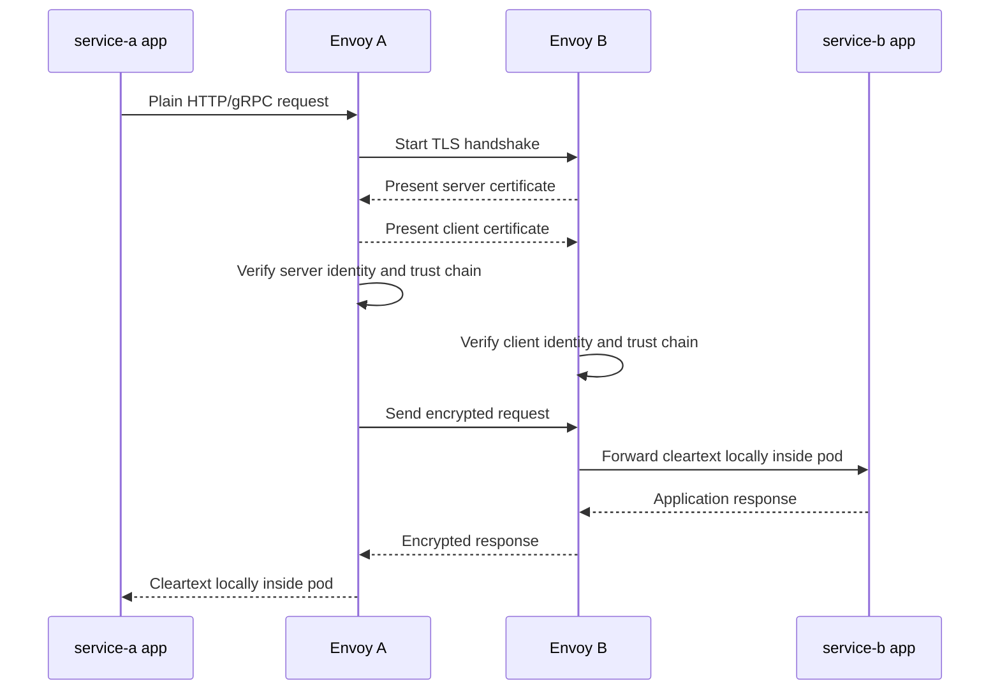
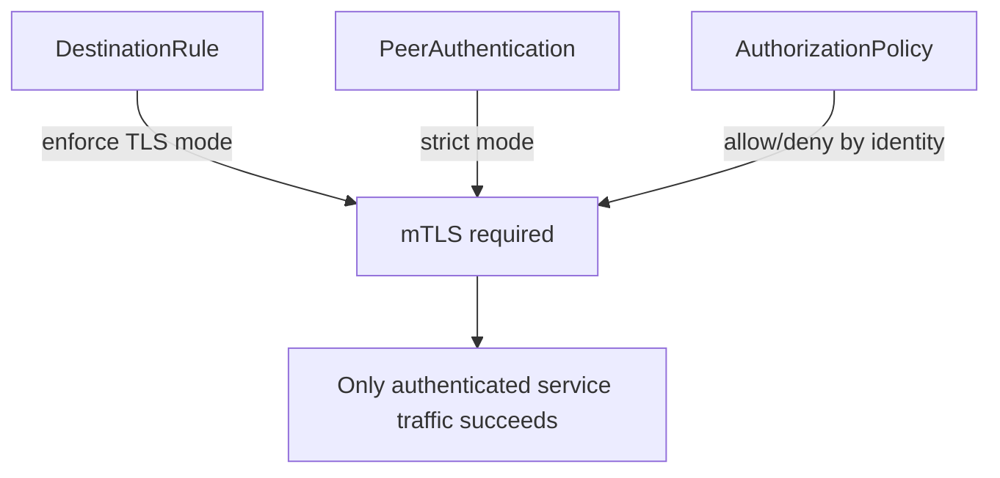

# 2. Istio mTLS Service-To-Service Flow

This article explains the internal east-west mTLS flow between microservices inside the mesh.

## What mTLS means here

Mutual TLS means both sides prove identity during the TLS handshake:

- the caller proves who it is
- the callee proves who it is
- both sides derive session keys for encrypted communication

In Istio, this happens automatically between sidecars when mesh mTLS is enabled.

## The runtime path

Assume `service-a` calls `service-b`.

The application containers usually do not perform TLS themselves in this model. The sidecars handle identity, certificate validation, encryption, decryption, and policy enforcement.

## How the certificate gets there

The certificate is typically based on the workload identity, often represented in SPIFFE-like form such as:

`spiffe://cluster.local/ns/app-payments/sa/payments-service`

## Full request flow

## What is actually authenticated

In the mesh, we do not only care about IP addresses. We care about workload identity:

- namespace
- service account
- workload identity
- mesh trust domain

This lets security policy say things like:

- only the `payments` service account may call `ledger`
- traffic must use mTLS, not plaintext
- only workloads from a certain namespace are trusted

## Why this is stronger than plain TLS

With plain server-side TLS only:

- the caller knows the server is genuine
- the server may not know the real caller identity

With mTLS:

- both sides authenticate each other
- authorization can be based on strong identity, not only source IP

## Where Vault is not in the direct request path

In the common architecture used here, Vault is not issuing the per-request or per-connection mesh certificate directly. That is Istio's job.

That means:

- Vault is not called when `service-a` calls `service-b`
- cert-manager is not called during normal service-to-service traffic
- the mesh is operationally independent for internal mTLS

## Policy view

## Common operational sequence

1. Workload starts in OpenShift.
2. Istio sidecar is injected.
3. Sidecar obtains workload identity material from Istiod.
4. Service A sends a request through its sidecar.
5. The sidecars perform mutual TLS.
6. Authorization policy is evaluated.
7. The request reaches the destination service only if trust and policy both pass.

## Common failure cases to explain live

### Certificate mismatch or unknown trust

The handshake fails because the presented peer identity is not trusted by the mesh.

### Plaintext traffic into a strict mTLS destination

The destination requires mTLS, but the caller is not using sidecar-based encrypted traffic.

### Wrong authorization policy

The TLS handshake succeeds, but the request is denied because the authenticated caller is not authorized.

## Teaching line for this article

Istio mTLS is primarily about **workload identity and service-to-service trust inside the cluster**, not about exposing a browser-facing certificate to users on the internet.
