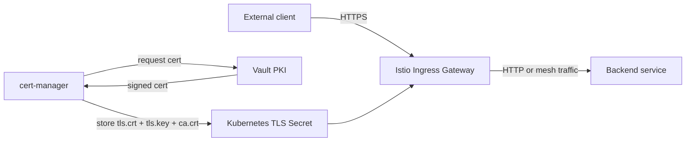
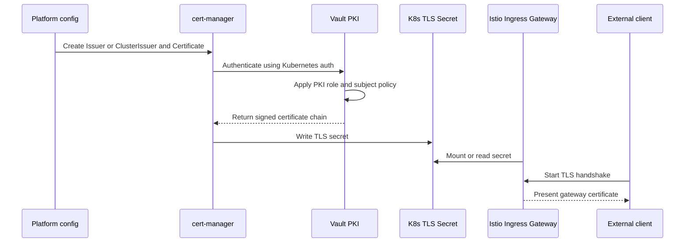
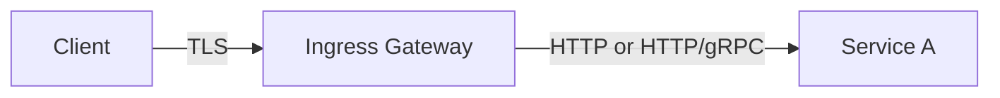
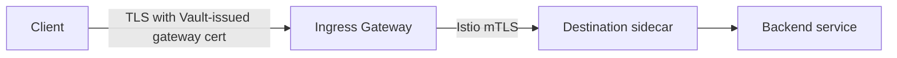
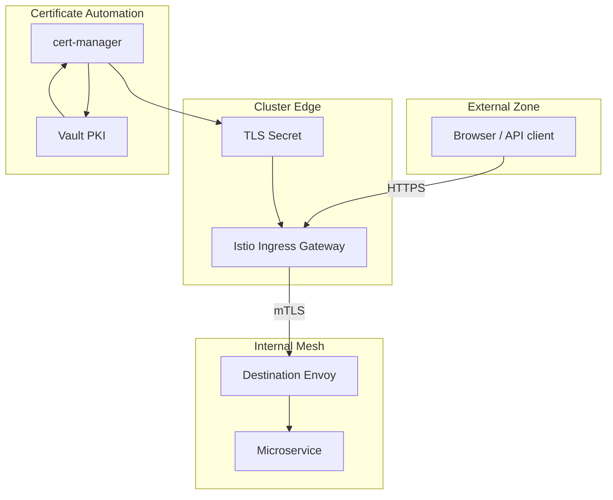

# 3. Ingress TLS With Vault And cert-manager

This article explains the north-south certificate flow from external client to Istio ingress gateway.

## What problem this solves

When a user, browser, partner system, or external API client connects to your platform, the gateway needs a server certificate that external clients can validate.

That certificate is not the same as the workload certificates used internally by Istio sidecars.

## High-level flow

## The issuance flow step by step

## Why cert-manager exists in the middle

cert-manager automates the certificate lifecycle:

- creates the request
- renews before expiry
- writes the resulting secret
- keeps the secret updated for the gateway

Without cert-manager, teams often renew certificates manually, which becomes slow, error-prone, and inconsistent.

## Why Vault exists in the middle

Vault provides PKI governance:

- allowed subject names
- allowed SANs
- TTL policy
- auditability
- site-specific PKI boundaries

That means platform security can control what kind of certificate may be issued to the gateway.

## Client-to-service path

There are two common variants.

### Variant A: TLS terminates at the gateway

In this mode, the external TLS session ends at the gateway. After that, traffic may enter the mesh and be protected by a separate internal mTLS session.

### Variant B: TLS at the edge, mTLS inside the mesh

This is the model most worth teaching because it shows the two layers clearly:

- edge TLS for the client-facing connection
- mesh mTLS for internal service-to-service trust

## Certificate data model

The gateway secret usually contains:

- `tls.crt`
- `tls.key`
- optionally `ca.crt` or full chain material

Istio reads that material when serving HTTPS at the gateway.

## The key identity difference

The ingress gateway certificate usually represents a DNS name such as:

- `api.example.com`
- `payments.example.com`
- `*.apps.example.com`

The mesh certificate represents a workload identity such as:

- namespace
- service account
- workload principal

These are different trust subjects for different audiences.

## A practical teaching diagram

## Common mistakes

### Mistake 1

Thinking the gateway certificate also secures all internal service-to-service calls.

It does not. That certificate secures the edge connection.

### Mistake 2

Trying to use one wildcard certificate as the identity for internal workloads.

That weakens the identity model and does not map cleanly to zero-trust service authorization.

### Mistake 3

Letting gateways use long-lived manually renewed certificates.

That creates operational and audit risk.

## Teaching line for this article

Vault plus cert-manager gives you **controlled and automated certificate issuance for the gateway**, while Istio gives you **automatic identity-based mTLS once traffic enters the mesh**.
