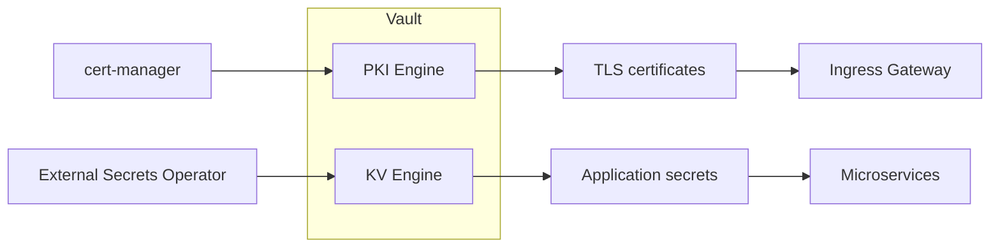
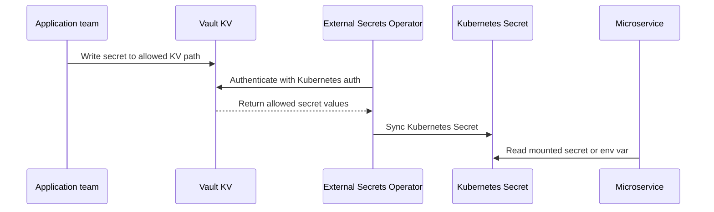
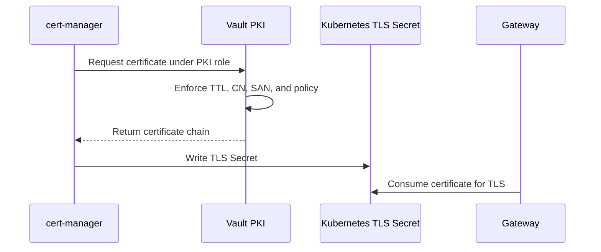
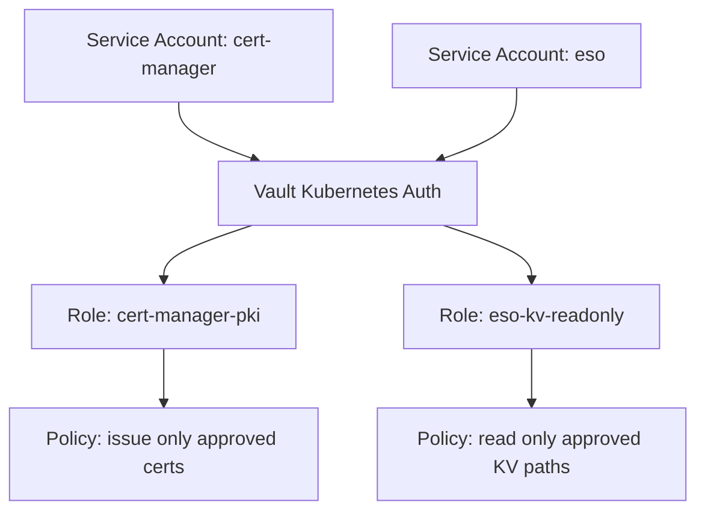

# 4. Secrets, Certificates, And Vault Integration

This article clarifies how Vault is used for both PKI and non-PKI secrets without mixing the two concepts.

## Two different Vault use cases

Vault usually plays two distinct roles in this design:

1. `Vault PKI`
   - issues certificates
   - enforces subject and lifetime policy
   - supports certificate-based trust

2. `Vault KV`
   - stores application secrets
   - passwords, tokens, API keys, connection strings
   - supports secret distribution

These are different engines, different policies, and often different consumers.

## Flow overview

## cert-manager path for certificates

cert-manager is the right choice when:

- the target is a Kubernetes TLS secret
- the secret should be renewed automatically
- the consumer is an ingress gateway or other K8s-native TLS consumer

## ESO path for secrets

ESO is the right choice when:

- the data is not a certificate issuance workflow
- the source is KV, not PKI
- the application expects a Kubernetes Secret

## End-to-end app secret flow

## End-to-end certificate flow

## Why not let all apps talk directly to Vault

Some applications do benefit from direct Vault integration, but many teams prefer ESO for common use cases because:

- application code stays simpler
- no Vault client library is required
- Kubernetes-native secret consumption still works
- namespace and role boundaries stay clear

A balanced rule is:

- use `ESO + KV` for standard application secrets
- use `cert-manager + PKI` for certificate automation
- use direct app-to-Vault integration only when dynamic secrets or advanced lease behavior is genuinely needed

## How authentication works

Both cert-manager and ESO authenticate to Vault using Kubernetes identities.

That usually means:

- a service account in OpenShift
- a Vault Kubernetes auth role
- a Vault policy restricting what that service account may read or issue

## The policy picture

## What your audience should leave with

They should understand that:

- not every secret is a certificate
- not every certificate should be treated like a generic secret
- Vault can serve both domains cleanly if the policies and consumers are separated

## Teaching line for this article

Vault is both a **certificate authority platform** and a **secret storage platform**, but the PKI and KV paths should remain operationally and conceptually separate.
