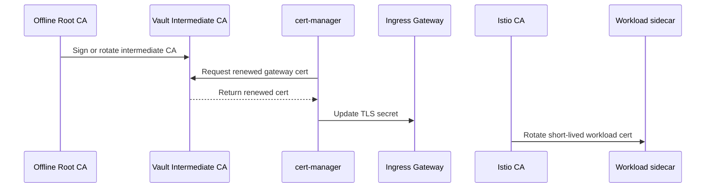
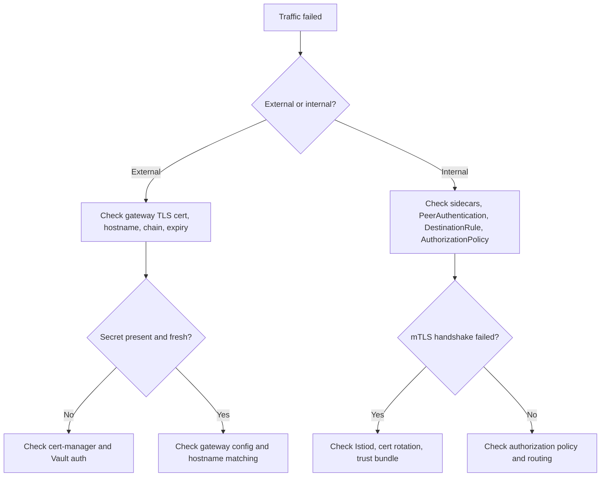

# 5. Certificate Lifecycle, Rotation, And Failure Flows

This article explains what happens after initial setup: issuance, renewal, rotation, expiry, and failure.

## Lifecycle layers

There are three certificate lifecycles worth discussing:

1. Offline root lifecycle
2. Vault intermediate and gateway certificate lifecycle
3. Istio workload certificate lifecycle

Each one rotates differently.

## Gateway certificate lifecycle

## Mesh workload certificate lifecycle

## Why short-lived certificates matter

Short-lived certificates reduce blast radius:

- less useful if stolen
- less operational pressure around revocation
- continuous renewal exercises the path regularly

This principle fits especially well with mesh-issued workload identities.

## Full rotation story

## Failure scenario 1: gateway certificate expires

What users see:

- browser warnings
- API clients reject the endpoint
- external traffic fails even if the backend service is healthy

What likely went wrong:

- cert-manager could not renew
- Vault PKI role or auth broke
- Certificate resource was misconfigured

## Failure scenario 2: workload certificate rotation fails

What users see:

- internal calls fail
- 503s or upstream TLS errors in the mesh
- some pods work while others fail after rotation thresholds

What likely went wrong:

- sidecar cannot contact Istiod
- mesh trust bundle changed incorrectly
- identity issuance or SDS delivery failed

## Failure scenario 3: wrong trust chain at the edge

What users see:

- clients reject the gateway certificate
- TLS handshake errors on the public endpoint

What likely went wrong:

- incomplete chain in secret
- wrong issuer configured
- a certificate for the wrong hostname was mounted

## Failure scenario 4: secret delivery works but auth policy fails

This is an important teaching case.

The flow can look healthy:

- gateway certificate is valid
- mesh mTLS is enabled
- app secrets are present

But traffic still fails because authorization and identity policy are separate from basic certificate presence.

## A practical troubleshooting tree

## Operational recommendations

1. Keep gateway certificates and mesh certificates as separate operational concerns.
2. Monitor certificate expiry for both gateway and intermediate CAs.
3. Test renewal before you need it.
4. Run failure drills for Vault outage, cert-manager auth failure, and mesh CA issues.
5. Document the expected trust chain for every externally exposed hostname.

## Teaching line for this article

Secure setups do not stay secure only because certificates exist; they stay secure because **issuance, renewal, trust chain management, and failure handling all keep working over time**.
