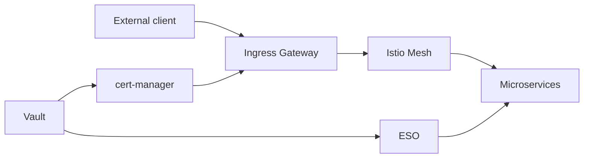
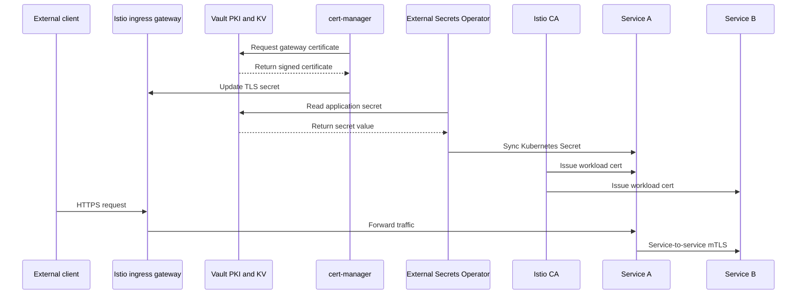

# 6. Session Walkthrough And Speaking Notes

This article gives you a ready flow for teaching the session live.

## Session objective

By the end of the session, the audience should understand:

- what mTLS is
- how Istio uses mTLS between microservices
- how ingress TLS differs from mesh mTLS
- how Vault, cert-manager, and ESO fit into the platform
- how certificates and secrets flow through the system

## Recommended session structure

### Part 1: Start with the architecture

Use [01-architecture-and-trust-model.md](/Users/ze/Documents/tutorials-presentations-docs/mtls/01-architecture-and-trust-model.md).

Core message:

- one platform
- multiple trust flows
- each tool has a clear job

## Opening diagram

## Suggested opening script

"There are two different TLS stories here. First, the client reaches the gateway using a normal server certificate. Second, once traffic enters the mesh, microservices authenticate each other with mTLS. Vault helps manage issued certificates and stored secrets, but Istio owns the internal workload identity flow."

### Part 2: Explain mTLS inside the mesh

Use [02-istio-mtls-service-to-service-flow.md](/Users/ze/Documents/tutorials-presentations-docs/mtls/02-istio-mtls-service-to-service-flow.md).

Core message:

- sidecars do the TLS work
- both caller and callee authenticate
- policy is identity-based

### Part 3: Explain ingress TLS

Use [03-ingress-tls-vault-cert-manager-flow.md](/Users/ze/Documents/tutorials-presentations-docs/mtls/03-ingress-tls-vault-cert-manager-flow.md).

Core message:

- client trusts gateway certificate
- cert-manager automates requests
- Vault signs according to policy

### Part 4: Explain secrets vs certificates

Use [04-secrets-certificates-and-vault-integration.md](/Users/ze/Documents/tutorials-presentations-docs/mtls/04-secrets-certificates-and-vault-integration.md).

Core message:

- PKI and KV are different
- cert-manager and ESO are different
- keep the flows mentally separate

### Part 5: Explain rotation and failure

Use [05-certificate-lifecycle-rotation-and-failure-flows.md](/Users/ze/Documents/tutorials-presentations-docs/mtls/05-certificate-lifecycle-rotation-and-failure-flows.md).

Core message:

- secure design is not only issuance
- rotation and failure behavior matter just as much

## A single end-to-end narrative

If you want one short narrative for the session, use this:

## Good questions to ask the audience

1. Which component owns the certificate seen by the external client?
2. Which component owns the workload identity between two microservices?
3. Is a password in Vault KV the same thing as a certificate issued by Vault PKI?
4. What breaks if the gateway certificate expires?
5. What breaks if mesh certificate rotation fails?

## Common misunderstandings to correct

### "Vault does all TLS everywhere"

Correction:

Vault helps manage PKI and secrets, but Istio usually handles runtime workload mTLS inside the mesh.

### "If the gateway has TLS, the cluster is fully mTLS-secure"

Correction:

Gateway TLS only covers the external edge connection. Internal service calls still need mesh mTLS and policy.

### "cert-manager and ESO do the same thing"

Correction:

cert-manager automates certificate issuance and renewal. ESO syncs secrets from secret stores into Kubernetes.

## Closing summary you can read out

"In this architecture, Vault is the central trust and secret platform, cert-manager automates certificate delivery to Kubernetes consumers like the ingress gateway, External Secrets Operator syncs application secrets from Vault KV, and Istio provides short-lived workload identity for internal mTLS. The whole design works well because each component has a clear responsibility and the trust boundaries stay clean."
