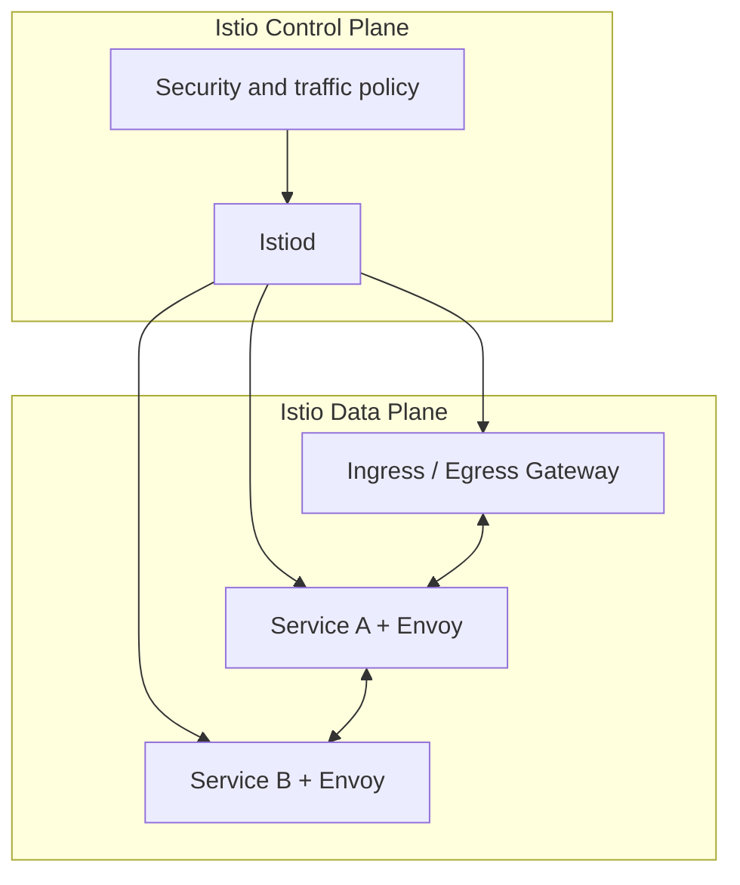
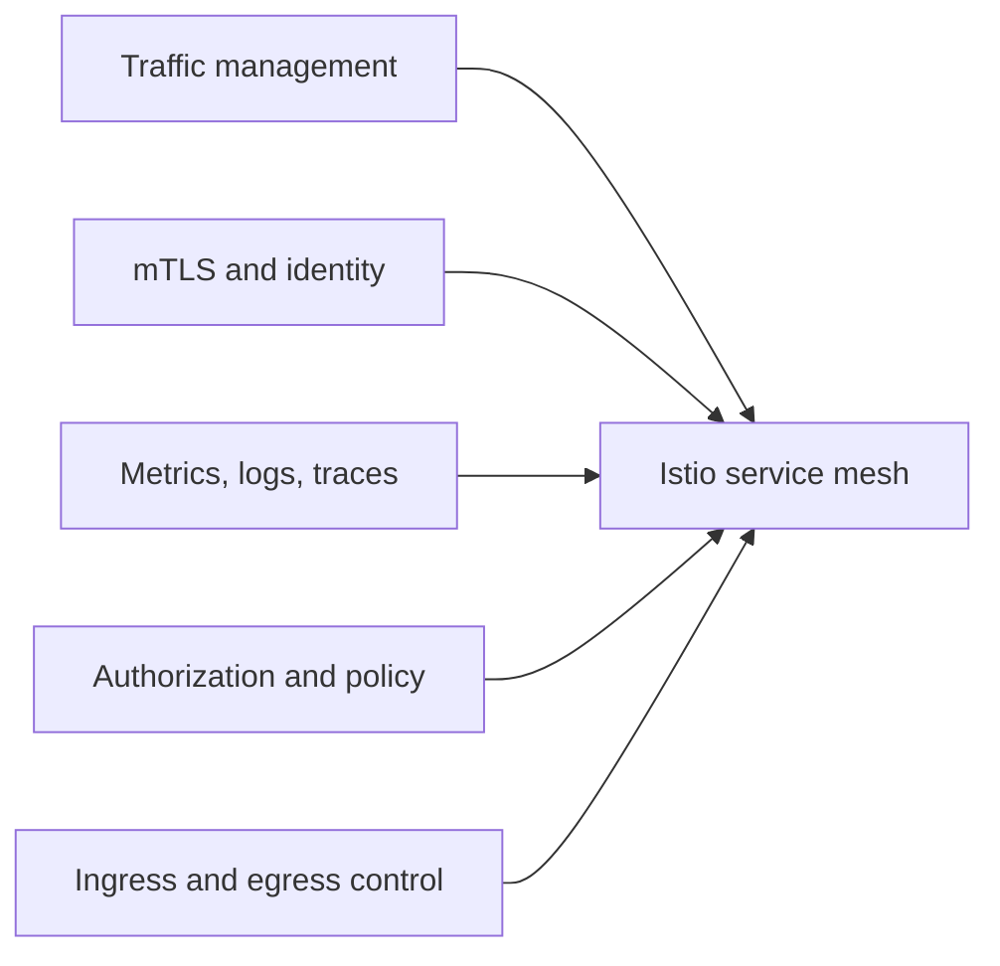

# Appendix 1: Istio Overview

This appendix gives a standalone overview of Istio so the audience understands the bigger platform role before focusing on mTLS, certificates, and Vault integration.

## What Istio is

Istio is a service mesh. It adds a shared control plane and data plane around application communication so that traffic, security, observability, and policy can be managed consistently across microservices.

In simple terms:

- applications still do business logic
- Envoy sidecars handle much of the networking behavior
- Istiod distributes configuration, identity, and trust information

## The six core functions of Istio

| Istio function | What it means in practice |
|---|---|
| Traffic management | Routing, retries, failover, canary release, and traffic shaping between services |
| Security | mTLS, workload identity, certificate rotation, and policy-based trust |
| Observability | Metrics, logs, traces, service graph visibility, and latency/error insight |
| Policy enforcement | Authorization, access rules, and guardrails around who can call what |
| Ingress and egress control | Managing traffic entering or leaving the mesh through controlled gateways |
| Resilience | Timeouts, retries, circuit-breaking patterns, and safer service communication |

## A simple mental model

## What each function looks like in your setup

### 1. Traffic management

Istio can decide how requests move between services:

- route version A users to `v1`
- route test users to `v2`
- retry selected failures
- shift traffic gradually during rollout

### 2. Security

This is the main focus of your session:

- sidecars authenticate each other
- traffic is encrypted between workloads
- short-lived workload certificates are rotated automatically
- policies can allow only trusted callers

### 3. Observability

Because the sidecars see service traffic, Istio can produce:

- request counts
- response codes
- latency metrics
- traffic topology
- trace correlation

### 4. Policy enforcement

Istio lets you say:

- only `payments` can call `ledger`
- traffic must be mTLS
- only selected namespaces may reach a service

### 5. Ingress and egress control

Istio also acts as the managed boundary for traffic:

- ingress gateway for incoming client traffic
- egress control for outbound dependencies
- centralized TLS handling and route policy at the edge

### 6. Resilience

Istio helps reduce failure spread by supporting patterns like:

- timeout control
- retries
- traffic splitting
- failure isolation

## One-slide Istio overview

## Why this matters before the mTLS topic

If you explain Istio only as "the thing that does mTLS," the audience may miss why it is in the platform at all.

The better framing is:

- Istio is the service communication layer
- mTLS is one of its most important security capabilities
- the rest of the platform design becomes easier to understand after that

## Suggested speaking line

"Istio is the service mesh layer that sits around microservice communication. It manages traffic, secures service calls with identity and mTLS, gives us observability, applies policy, and controls gateway traffic. In this session, we’ll focus mainly on the security and certificate parts of that bigger picture."
