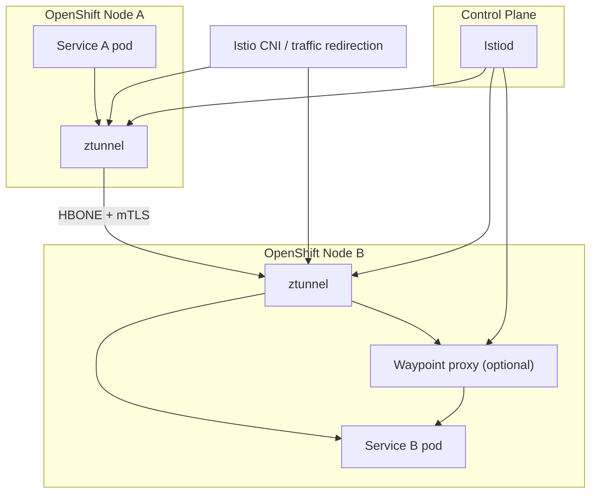
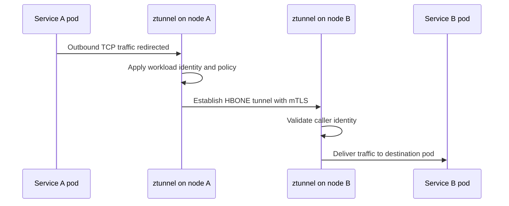
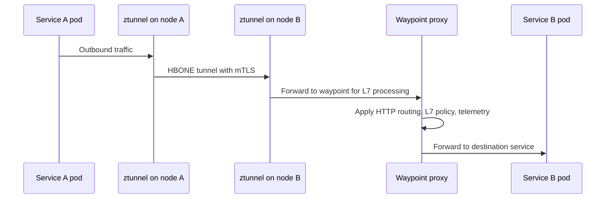
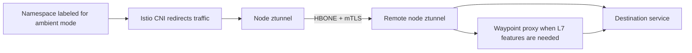
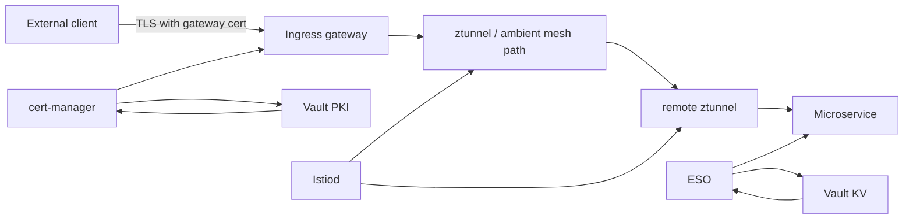

# Appendix 2: How It Works In OpenShift Service Mesh 3 Ambient Mode

This appendix explains how the same security model changes when you use **Red Hat OpenShift Service Mesh 3 ambient mode** instead of the classic sidecar-based mesh.

It is written for the same audience as the rest of this pack:

- OpenShift platform teams
- Istio or Service Mesh operators
- microservice application teams
- security and PKI teams

## The short version

In classic Istio sidecar mode:

- each application pod usually gets its own Envoy sidecar
- the sidecar handles mTLS, policy, telemetry, and traffic features for that pod

In **ambient mode**:

- application pods do not need sidecars for basic mesh participation
- a **ztunnel** runs on each node and provides the secure L4 overlay
- optional **waypoint proxies** provide L7 features only where needed

That means ambient mode changes the **data plane shape**, not the core zero-trust goal.

## Ambient mode building blocks

According to the current Istio and Red Hat OpenShift Service Mesh documentation, ambient mode is built from these core pieces:

- `ztunnel`: per-node L4 proxy for secure overlay traffic
- `waypoint proxy`: optional Envoy-based L7 proxy for selected services or namespaces
- `Istio CNI`: redirects workload traffic into the ambient data plane
- `Istiod`: still distributes identity, trust, and policy information

## High-level architecture

## What changes compared to sidecar mode

| Topic | Sidecar mode | Ambient mode |
|---|---|---|
| Data plane location | One Envoy sidecar per pod | One `ztunnel` per node plus optional waypoint |
| Basic mTLS | Sidecar to sidecar | ztunnel to ztunnel |
| L7 policy and routing | In the sidecar Envoy | In waypoint proxies |
| App pod changes | Sidecar injected into pod | No sidecar needed for basic participation |
| Operational overhead | Higher per pod | Lower per pod, shifted to node and waypoint layers |

## The L4 secure overlay

The heart of ambient mode is the **L4 secure overlay**.

Instead of every pod carrying its own sidecar, traffic is redirected to the node-local `ztunnel`. The ztunnel then establishes secured mesh transport between workloads.

Istio’s documentation describes this overlay as using **HBONE**, which is an HTTP CONNECT-based tunneling approach used to carry secure mesh traffic.

### L4 path without a waypoint

In this model:

- the application still sends traffic normally
- the platform redirects it into the mesh path
- ztunnel handles encryption and identity at Layer 4

## Where mTLS happens in ambient mode

mTLS still exists, but the participants are different.

In sidecar mode:

- Envoy sidecar to Envoy sidecar

In ambient mode:

- `ztunnel` to `ztunnel` for the base mesh path

This is an important teaching point:

- **ambient mode does not remove mTLS**
- **ambient mode changes where the mTLS work is done**

## When you need a waypoint proxy

The base ambient overlay gives you strong L4 security and basic mesh behavior, but not every advanced feature.

You deploy a **waypoint proxy** when you need Layer 7 features such as:

- HTTP routing decisions
- header-based logic
- richer L7 authorization
- richer L7 telemetry
- HTTP or gRPC traffic management

### Traffic path with a waypoint

## What OpenShift Service Mesh 3 adds to the picture

In **Red Hat OpenShift Service Mesh 3**, ambient mode is integrated into the supported operator-driven model.

From the Red Hat documentation, the practical points that matter most are:

- ambient mode is available in OpenShift Service Mesh 3.x, not the older 2.6 architecture
- the mesh is installed with an ambient profile
- `ztunnel` must be trusted by the control plane and installed in its expected namespace
- the **Gateway API** is the recommended way to configure ingress in ambient mode
- OpenShift networking prerequisites matter, including the documented OVN-Kubernetes gateway mode requirement

## Support and caution points

There are a few platform-specific cautions worth stating clearly in the session:

- Red Hat documents ambient mode as a newer architecture with different operational considerations than classic sidecar mode
- the Red Hat installation documentation says ambient mode must not be used on clusters that use OpenShift Service Mesh 2.6 or earlier
- the documented installation path for ambient mode requires the relevant OpenShift and Service Mesh 3 versions plus the required Gateway API CRDs

This is useful to say out loud because teams often assume ambient mode is just a simple switch from sidecars. Operationally, it is a different model.

## How workloads join the ambient mesh

In ambient mode, you typically bring a namespace or workload into the mesh by applying the ambient dataplane label.

Red Hat’s gateway documentation shows the namespace label:

- `istio.io/dataplane-mode=ambient`

After that:

- traffic is redirected by Istio CNI
- the workload uses the node-level ambient data plane
- no sidecar injection is needed for basic L4 participation

## Ambient mode flow on OpenShift

## Ingress in ambient mode

Ingress is another place where ambient mode changes the guidance.

In older or classic Istio examples, people often use:

- Istio `Gateway`
- Istio `VirtualService`

For **OpenShift Service Mesh 3 ambient mode**, Red Hat recommends using the **Kubernetes Gateway API** instead.

That usually means:

- `Gateway`
- `HTTPRoute`
- `GRPCRoute` where needed

And if you need L7 processing inside the ambient mesh for a service, a waypoint proxy can participate in that path.

## Ambient mode and your existing Vault/cert-manager design

The good news is that the ambient shift does **not** change your PKI roles in the same way it changes the data plane.

Your existing design still maps cleanly:

- **Istio ambient data plane** handles internal mesh transport and workload identity behavior
- **Vault + cert-manager** still handle gateway or externally managed certificates
- **Vault KV + ESO** still handle non-certificate application secrets

### The updated mental model

## What is handled at L4 versus L7

This is the most important architecture distinction in ambient mode.

| Capability | ztunnel only | waypoint required |
|---|---|---|
| Encrypted in-mesh transport | Yes | No |
| Workload identity for secure overlay | Yes | No |
| Basic L4 policy | Yes | No |
| HTTP routing and matching | No | Yes |
| L7 authorization | No | Yes |
| Rich L7 telemetry | No | Yes |

## Benefits of ambient mode for OpenShift teams

Ambient mode is attractive because it can reduce common sidecar pain points:

- lower per-pod overhead
- less sidecar lifecycle management
- easier incremental adoption
- clearer separation between base secure transport and advanced application-layer features

## Tradeoffs to explain honestly

Ambient mode is not just "better sidecars." It is a different operational model.

Important tradeoffs include:

- you now reason about node-level `ztunnel` behavior
- L7 features are no longer automatic everywhere; they appear where waypoints are deployed
- ingress and routing guidance shifts toward Kubernetes Gateway API
- your troubleshooting model changes because traffic is no longer pod-sidecar to pod-sidecar

## A clean way to explain this in the session

Use this sentence:

"In OpenShift Service Mesh 3 ambient mode, the mesh moves from a per-pod sidecar model to a two-layer model: ztunnel gives every enrolled workload a secure L4 zero-trust overlay, and waypoint proxies are added only where we need advanced L7 behavior. Our Vault, cert-manager, and secret-management design still fits, but the internal traffic path is now ztunnel-based rather than sidecar-based."

## Suggested source references

These were the primary references used for this appendix:

- Red Hat OpenShift Service Mesh 3 ambient installation documentation: [docs.redhat.com](https://docs.redhat.com/en/documentation/red_hat_openshift_service_mesh/3.2/html/installing/ossm-istio-ambient-mode)
- Red Hat OpenShift Service Mesh 3 gateways documentation: [docs.redhat.com](https://docs.redhat.com/en/documentation/red_hat_openshift_service_mesh/3.3/html-single/gateways/index)
- Istio ambient overview: [istio.io](https://istio.io/latest/docs/ambient/overview/)
