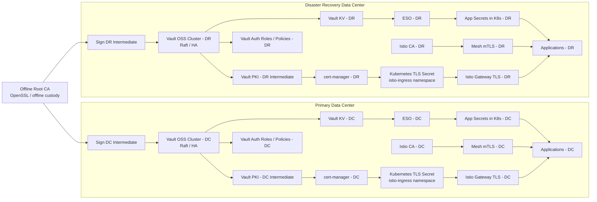
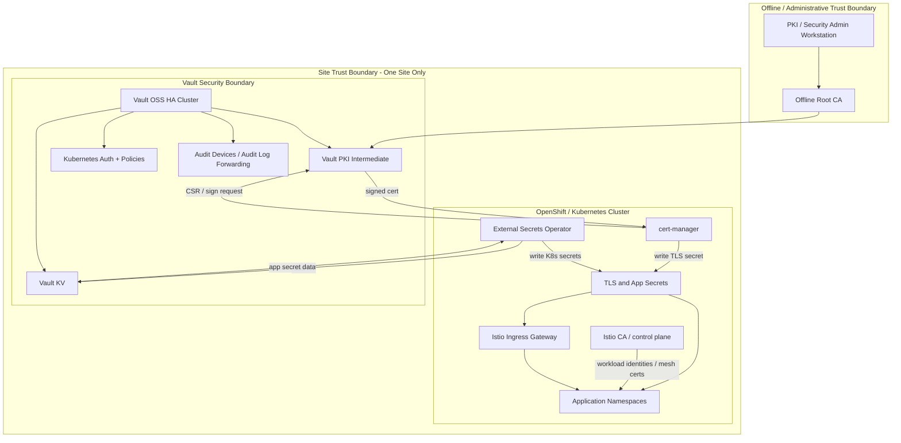

# Production Reference Architecture  
**Vault OSS + cert-manager + External Secrets Operator + two independent Istio meshes (DC/DR)**

This architecture is suitable for a regulated environment if you treat DC and DR as **independent security domains with coordinated PKI policy**, not as a single replicated Vault control plane.

---

## 1. Executive design

### Core design choices
- **Offline Root CA**
  - Generated with OpenSSL
  - Kept offline
  - Used only to sign intermediate CAs and for controlled rollover/emergency operations

- **Two separate Vault OSS clusters**
  - One in **DC**
  - One in **DR**
  - Each runs **integrated Raft storage**
  - Each has its **own intermediate CA**
  - Each has its **own KV secret paths and auth roles**

- **Two independent Istio meshes**
  - One mesh per site
  - No multicluster control plane dependency
  - Each mesh uses **Istio CA** for **east-west workload mTLS**

- **cert-manager**
  - Uses **Vault Issuer/ClusterIssuer**
  - Requests and renews **gateway/server certificates**
  - Writes TLS secrets into Kubernetes for the Istio ingress gateway

- **External Secrets Operator**
  - Reads **KV secrets** from Vault
  - Syncs those into Kubernetes Secrets for application consumption

---

## 2. Component diagrams

### 2.1 Logical enterprise view

---

### 2.2 Site-level detailed view

---

## 3. Trust boundaries

### Boundary A — Offline root authority
**Contents**
- Offline Root CA private key
- Root certificate lifecycle operations
- Intermediate signing ceremonies
- CA rollover / emergency revocation governance

**Security posture**
- No runtime application access
- No direct Kubernetes integration
- Strict dual-control process
- Hardware-backed key storage strongly preferred
- Access limited to PKI/security officers

**Rule**
- Root CA never issues end-entity application certs directly.

---

### Boundary B — Vault security boundary per site
**Contents**
- Vault OSS HA cluster
- Intermediate CA private key for that site
- KV secrets for that site
- Auth methods, roles, and policies
- Audit devices/log export

**Security posture**
- DC Vault and DR Vault are separate trust domains
- Separate unseal process or auto-unseal mechanism
- Separate policies and separate Kubernetes auth mappings
- No shared long-lived operator tokens across sites

**Rule**
- DC workloads authenticate only to DC Vault
- DR workloads authenticate only to DR Vault
- Cross-site secret reads are disallowed except via formal break-glass mechanism

---

### Boundary C — Kubernetes platform boundary per site
**Contents**
- OpenShift/Kubernetes control plane
- cert-manager
- External Secrets Operator
- Istio control plane
- Kubernetes secrets created by controllers

**Security posture**
- Namespace-level segmentation
- Separate service accounts per controller
- Minimal RBAC
- Secret access limited by namespace and purpose
- Admission controls and image signing strongly recommended

**Rule**
- cert-manager may request cert issuance from Vault PKI only for approved subject names/SANs
- ESO may read only approved KV paths
- Applications never receive broad Vault tokens

---

### Boundary D — Application/workload boundary
**Contents**
- Business services
- API gateways
- Batch jobs
- Internal service-to-service traffic

**Security posture**
- Service identities are mesh-local
- East-west mTLS is handled by Istio CA
- North-south TLS certs come from Vault PKI via cert-manager
- Secrets are consumed from Kubernetes Secrets synced by ESO or via app-native Vault integration where justified

**Rule**
- Do not reuse ingress TLS certificate model for mesh workload identities
- Do not use one certificate hierarchy for every purpose without policy separation

---

### Boundary E — External enterprise integrations
**Contents**
- SIEM / SOC
- NTP / DNS
- Monitoring
- Backup
- ITSM / approval workflow
- HSM/KMS if added later

**Security posture**
- One-way audited integration wherever possible
- Audit logs exported centrally
- Time synchronization mandatory
- DNS integrity critical for gateway cert issuance and service routing

---

## 4. Recommended production roles and responsibilities

| Component | Primary role | Should store private keys? | Notes |
|---|---|---:|---|
| Offline Root CA | Signs intermediates only | Yes | Offline, tightly controlled |
| Vault PKI Intermediate | Signs gateway/app platform certs | Yes | Separate intermediate per site |
| cert-manager | Certificate lifecycle controller | No permanent CA key | Requests/signs via Vault |
| ESO | Secret sync controller | No | Reads KV, writes K8s secrets |
| Istio CA | Mesh workload identity | Yes, mesh-local | Separate from ingress TLS model |
| Istio Gateway | Presents public/internal TLS cert | Uses secret | Consumes K8s TLS secret |
| Applications | Consume secrets and mesh identity | Usually no | Avoid embedding CA management logic unless necessary |

---

## 5. Recommended certificate model

### 5.1 Separate certificate purposes

#### Root CA
- Long-lived
- Offline
- Signs only intermediates

#### Vault intermediate per site
- One for DC
- One for DR
- Can be same policy family under the same root
- Better: distinct intermediates for distinct purposes where scale/compliance justifies it:
  - `dc-ingress-intermediate`
  - `dr-ingress-intermediate`
  - optional separate internal platform/app intermediates later

#### Istio CA
- Only for workload-to-workload mTLS inside each independent mesh
- Not for external gateway public/server certificates

### 5.2 TTL guidance

| Certificate type | Typical posture |
|---|---|
| Root CA | Multi-year, offline |
| Intermediate CA | 1–3 years depending on policy |
| Gateway/server certs | Short-lived, automated renewal |
| Mesh workload certs | Very short-lived, automated by mesh |

---

## 6. Authentication and policy model

### 6.1 Vault auth
Use **Kubernetes auth** for both controllers, but with separate roles and policies.

#### Recommended Vault roles per site
- `eso-kv-readonly-<site>`
- `cert-manager-pki-issuer-<site>`
- optional:
  - `platform-ops-breakglass-<site>`
  - `security-audit-read-<site>`

#### Minimum policy separation
- ESO:
  - read only from specific KV paths
  - no PKI access
- cert-manager:
  - sign only against specific PKI roles
  - restricted domains / SAN patterns
  - no generic KV access
- admins:
  - no day-to-day root token use
  - separate break-glass identity path

### 6.2 Kubernetes scoping
- Prefer **namespaced SecretStore** for ESO where possible
- Use **ClusterSecretStore** only when the governance case is strong and tightly controlled
- Separate service accounts for:
  - cert-manager controller
  - ESO controller
  - Vault injector if ever added later

---

## 7. DC/DR decision table

### 7.1 Core decisions

| Topic | DC decision | DR decision | Recommended position |
|---|---|---|---|
| Vault topology | HA Vault OSS with Raft | HA Vault OSS with Raft | Same topology in both sites |
| Vault replication | None in OSS | None in OSS | Treat as independent clusters |
| PKI | DC intermediate CA | DR intermediate CA | Separate intermediates, same offline root |
| Mesh | Independent Istio mesh | Independent Istio mesh | Correct choice for simpler ops |
| Gateway TLS | Vault PKI via cert-manager | Vault PKI via cert-manager | Yes |
| Workload mTLS | Istio CA | Istio CA | Yes |
| Secret sync | ESO from DC Vault | ESO from DR Vault | Site-local only |
| App secrets | DC-local KV paths | DR-local KV paths | No cross-site live dependency |
| Failover | Application/platform runbook | Application/platform runbook | Manual or orchestrated at app layer |
| DNS/GSLB | Prefer controlled failover | Prefer controlled failover | Avoid implicit secret/control-plane dependency |

### 7.2 Runtime dependency table

| Capability | Normal operation in DC | Normal operation in DR | During DC outage | During DR outage |
|---|---|---|---|---|
| Vault secret read | DC Vault | DR Vault | DR must continue using DR Vault only | DC continues using DC Vault only |
| New gateway cert issuance | DC Vault PKI | DR Vault PKI | DR must issue from DR PKI | DC must issue from DC PKI |
| Existing gateway TLS | Existing secret valid | Existing secret valid | Continues until expiry if already provisioned | Continues until expiry if already provisioned |
| Mesh mTLS | DC Istio CA | DR Istio CA | DC unavailable; DR mesh independent | DR unavailable; DC mesh independent |
| Secret sync to apps | ESO from DC Vault | ESO from DR Vault | DR continues independently | DC continues independently |
| Root CA operations | Offline only | Offline only | No runtime dependency | No runtime dependency |

### 7.3 Failover design choices

| Decision point | Option A | Option B | Recommendation |
|---|---|---|---|
| Site activation | Active/Passive | Active/Active | Active/Passive is simpler for regulated ops unless business requires dual-active |
| DNS failover | Manual approval-driven | Automatic | Manual or tightly governed automation for finance |
| Secret consistency | Replicate business values outside Vault | Manually maintain in both | Use controlled secret promotion pipeline, not ad hoc copying |
| PKI continuity | Same root, separate intermediates | Separate roots per site | Same root + separate intermediates is usually the best balance |
| Vault recovery | Restore from backup | Rebuild + re-enroll | Maintain both backup and rebuild runbooks |

---

## 8. Security controls required for a financial institution

### 8.1 Mandatory controls
- Vault audit logging enabled in both sites
- Central log forwarding to SIEM/SOC
- Dual control for root/intermediate operations
- Strict RBAC for Kubernetes controllers
- Short-lived certs
- Rotation policies for:
  - unseal keys / bootstrap material
  - Vault tokens/roles
  - app secrets
- Backups for Vault Raft snapshots and recovery testing
- Time sync and DNS hardening
- Namespace isolation and network policies
- Admission policy for image provenance and manifest control

### 8.2 Strongly recommended controls
- HSM or equivalent protected custody for offline root key
- Dedicated infra nodes for Vault / Istio control plane
- Separate admin plane from app plane
- Break-glass accounts with monitoring and approval workflow
- Certificate issuance approval workflow for sensitive names
- Periodic restore drills and failover exercises

---

## 9. Reference namespace and component layout

### DC site
- `vault-system`
  - Vault OSS nodes
- `cert-manager`
  - cert-manager controller
- `external-secrets`
  - ESO controller
- `istio-system`
  - Istio control plane
  - Ingress gateway
- `app-*`
  - Business services

### DR site
- Same pattern, independent.

---

## 10. Recommended operating model

### 10.1 Normal state
- DC applications use DC mesh + DC Vault + DC cert-manager + DC ESO
- DR applications use DR mesh + DR Vault + DR cert-manager + DR ESO
- Both sites can be running, but each site remains **cryptographically and operationally self-sufficient**

### 10.2 During failover
- Traffic shifts to DR
- DR continues with:
  - DR Vault
  - DR PKI
  - DR ESO
  - DR cert-manager
  - DR Istio CA
- No dependency on reaching DC Vault to issue a cert or sync a secret

---

## 11. What not to do

- Do **not** use ESO as your certificate issuance lifecycle mechanism for Istio gateway certs; use cert-manager for PKI flows.
- Do **not** make DR depend on DC Vault during a site outage.
- Do **not** use the same broad Vault token for ESO, cert-manager, and administrators.
- Do **not** let the offline root become an online runtime dependency.
- Do **not** mix mesh workload CA and ingress/public server CA unless there is a very specific compliance-driven reason.

---

## 12. Final recommended architecture statement

### Recommended target state
For a financial institution, the recommended production reference architecture is:

- **Offline OpenSSL Root CA**
- **Vault OSS HA with integrated Raft in DC**
- **Vault OSS HA with integrated Raft in DR**
- **Separate intermediate CA per site**
- **cert-manager using Vault Issuer/ClusterIssuer for gateway TLS certificates**
- **ESO using Vault KV for application secrets**
- **Two fully independent Istio meshes**
- **Istio CA for service-to-service mTLS within each site**
- **Site-local operation during outage/failover**
- **Audit, backup, and runbook-driven recovery as first-class controls**

---

## 13. Opinionated improvements

1. **One intermediate per site for ingress/server TLS**, and keep Istio mesh CA separate.
2. **No shared cross-site secret backend** at runtime.
3. **Controlled secret promotion pipeline** from DC to DR for business secrets that must match.
4. **Manual or tightly governed DNS/GSLB failover**, not uncontrolled automatic failover.
5. **Quarterly failover drill** including:
   - Vault restore validation
   - cert-manager renewal in DR
   - ESO sync validation
   - gateway certificate validation
   - mesh mTLS validation
6. **Formal PKI lifecycle documents**
   - issuance policy
   - subject/SAN policy
   - revocation procedure
   - root/intermediate rollover procedure
   - incident break-glass procedure
