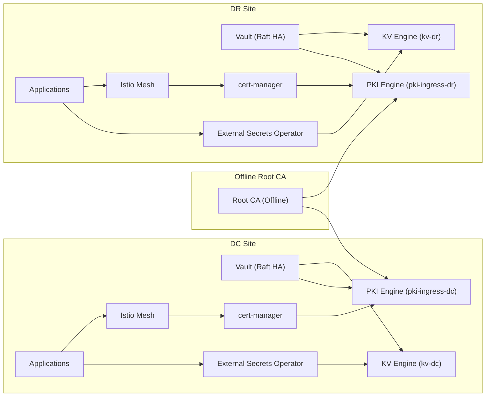

# Implementation Blueprint  
Vault OSS + cert-manager + ESO + Two Independent Istio Meshes (DC/DR)

---

## Architecture Diagram (Mermaid)



---

## Assumptions

- Two independent Kubernetes/OpenShift clusters (DC + DR)
- Two independent Vault clusters
- One offline Root CA
- One Intermediate CA per site
- cert-manager handles PKI
- ESO handles KV secrets
- Istio CA handles mTLS

---

## Namespace Layout

| Namespace | Purpose |
|----------|--------|
| vault-system | Vault cluster |
| cert-manager | cert-manager |
| external-secrets | ESO |
| istio-system | Istio |
| platform-secrets | Shared secrets |
| app-<name> | Applications |

---

## Vault Mount Layout

### DC
- auth/kubernetes-dc
- kv-dc
- pki-ingress-dc

### DR
- auth/kubernetes-dr
- kv-dr
- pki-ingress-dr

---

## Vault Roles

### DC
- eso-kv-readonly-dc
- cert-manager-pki-issuer-dc
- breakglass-dc

### DR
- eso-kv-readonly-dr
- cert-manager-pki-issuer-dr
- breakglass-dr

---

## Vault Policy Example

```hcl
path "kv-dc/data/apps/*" {
  capabilities = ["read"]
}
```

---

## PKI Roles

| Role | Site | Purpose |
|------|------|--------|
| role-istio-gateway-dc | DC | Gateway TLS |
| role-istio-gateway-dr | DR | Gateway TLS |

---

## ESO Layout

- ClusterSecretStore per site
- SecretStore per application

---

## cert-manager Layout

- ClusterIssuer per site
- Issues TLS for Istio gateway

---

## Istio Integration

- Gateway TLS → Vault PKI via cert-manager
- mTLS → Istio CA

---

## Deployment Phases

### Phase 0 — Prerequisites
- DNS finalized
- Certificate policy defined
- Root CA ready

### Phase 1 — Root CA
- Generate offline root
- Sign intermediates

### Phase 2 — Vault (DC)
- Deploy Vault HA
- Enable KV + PKI
- Create policies + roles

### Phase 3 — Controllers
- Install cert-manager
- Install ESO
- Install Istio

### Phase 4 — cert-manager
- Create ClusterIssuer
- Issue gateway certificate

### Phase 5 — ESO
- Create SecretStores
- Sync secrets

### Phase 6 — Workloads
- Deploy apps
- Enable Istio

### Phase 7 — DR
- Repeat all steps

### Phase 8 — Failover
- Validate DR independence
- Run failover drill

---

## Artifact Structure

### DC

```
00-namespaces-dc.yaml
01-vault-install-dc.yaml
02-vault-bootstrap-dc.sh
03-vault-policies-dc.hcl
04-vault-roles-dc.sh
05-cert-manager-install-dc.yaml
06-eso-install-dc.yaml
07-istio-install-dc.yaml
08-clusterissuer-dc.yaml
09-gateway-certificate-dc.yaml
10-secretstores-dc.yaml
11-externalsecrets-dc.yaml
12-app-deployments-dc.yaml
90-validation-dc.sh
```

### DR
Same structure with -dr

---

## Example Application (payments)

### DC
- Namespace: app-payments
- Vault path: kv-dc/data/apps/payments/prod
- SecretStore: vault-kv-dc-payments

### DR
- Namespace: app-payments
- Vault path: kv-dr/data/apps/payments/prod
- SecretStore: vault-kv-dr-payments

---

## Production Rules

1. One site = one Vault + one PKI + one mesh
2. cert-manager → PKI, ESO → KV
3. No cross-site dependency
4. Same structure, different values
5. Always test failover
