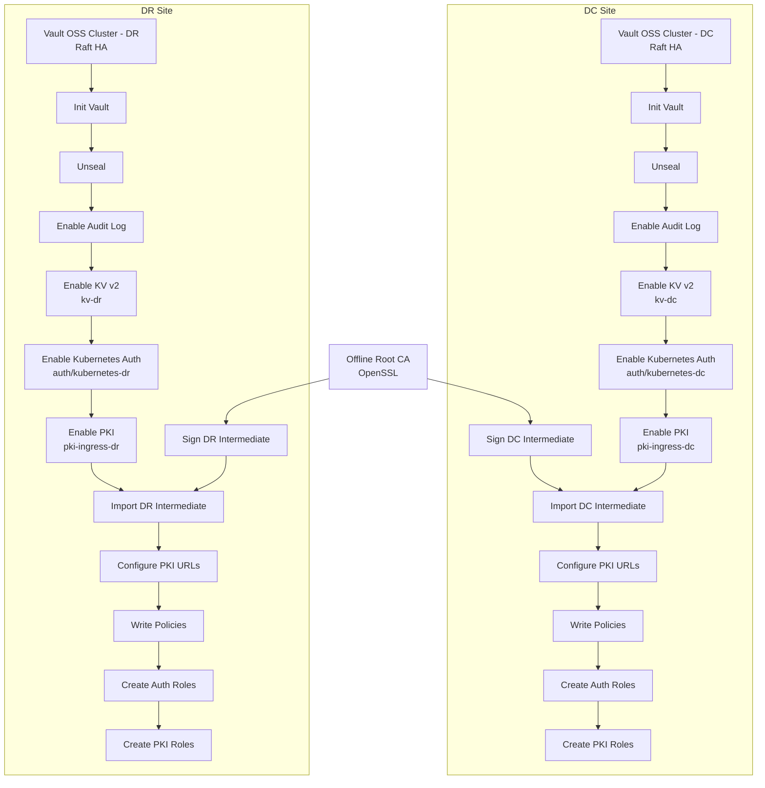
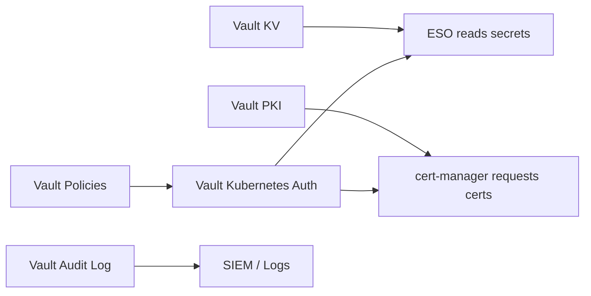
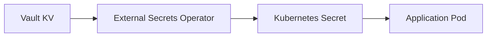

# Vault Setup with KV (DC/DR) — Implementation Guide

## Overview

This document describes the **Vault OSS setup** for:

- DC and DR sites
- KV secrets engine
- PKI engine
- Kubernetes authentication
- Policy and role structure

---

# Architecture Diagram

---

# Vault Internal Components

---

# Setup Flow

```mermaid
flowchart LR
    A[Deploy Vault] --> B[Init / Unseal]
    B --> C[Enable Audit]
    C --> D[Enable KV]
    D --> E[Enable K8s Auth]
    E --> F[Enable PKI]
    F --> G[Import Intermediate]
    G --> H[Write Policies]
    H --> I[Create Auth Roles]
    I --> J[Create PKI Roles]
    J --> K[Validate]
```

---

# Step-by-Step Setup

## Phase 1 — Offline Root CA

1. Generate root CA (offline)
2. Store private key securely
3. Create:
   - DC intermediate CSR
   - DR intermediate CSR
4. Sign both with root CA

---

## Phase 2 — Deploy Vault (DC)

1. Create namespace:
   kubectl create ns vault-system

2. Deploy Vault OSS (HA + Raft)

3. Verify:
   kubectl get pods -n vault-system

---

## Phase 3 — Initialize and Unseal

vault operator init  
vault operator unseal  

---

## Phase 4 — Enable Audit Log

vault audit enable file file_path=/vault/audit/vault_audit.log

---

## Phase 5 — Enable KV

vault secrets enable -path=kv-dc -version=2 kv

---

## Phase 6 — Enable Kubernetes Auth

vault auth enable -path=kubernetes-dc kubernetes

---

## Phase 7 — Enable PKI

vault secrets enable -path=pki-ingress-dc pki

---

## Phase 8 — Import Intermediate CA

vault write pki-ingress-dc/config/ca pem_bundle=@dc-intermediate-chain.pem

---

## Phase 9 — Configure PKI URLs

vault write pki-ingress-dc/config/urls issuing_certificates="https://vault-dc:8200/v1/pki-ingress-dc/ca"

---

## Phase 10 — Policies

KV policy:
path "kv-dc/data/*" { capabilities = ["read"] }

PKI policy:
path "pki-ingress-dc/sign/role-istio-gateway-dc" { capabilities = ["update"] }

---

## Phase 11 — Roles

ESO role and cert-manager role creation

---

## Phase 12 — PKI Role

vault write pki-ingress-dc/roles/role-istio-gateway-dc allowed_domains="dc.bank.example.com"

---

## Phase 13 — Validation

vault status

---

# DR Setup

Repeat with kv-dr, pki-ingress-dr

---

# KV Flow

---

# Key Rules

- KV = secrets  
- PKI = certificates  
- ESO = KV  
- cert-manager = PKI  
- Istio CA = mTLS  

---

# Summary

Secure, production-grade Vault setup for DC/DR.
