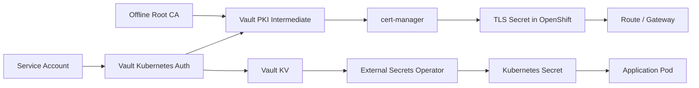
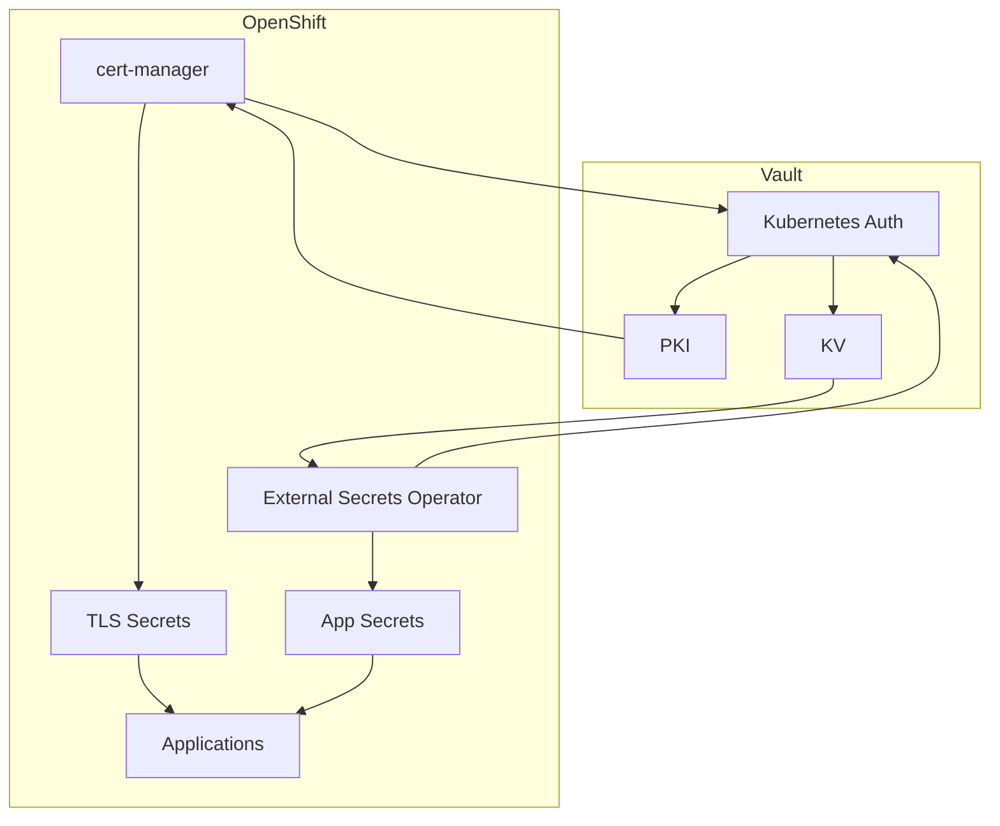
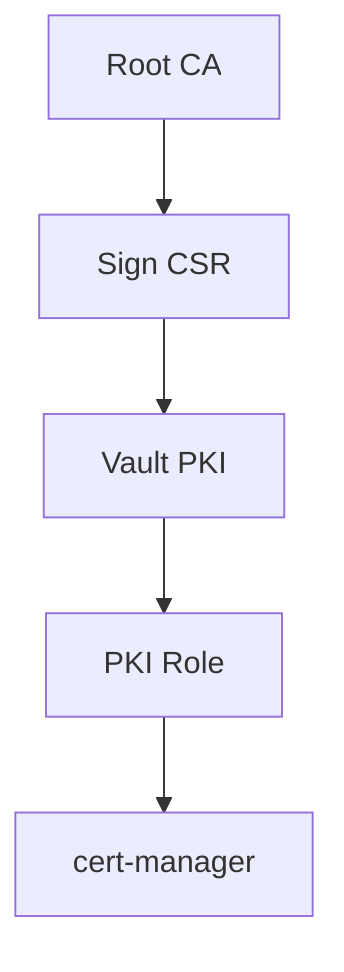
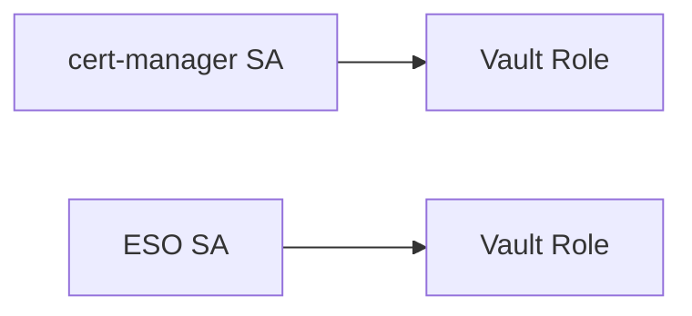
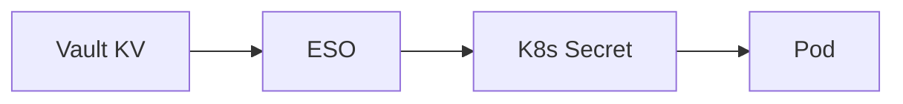
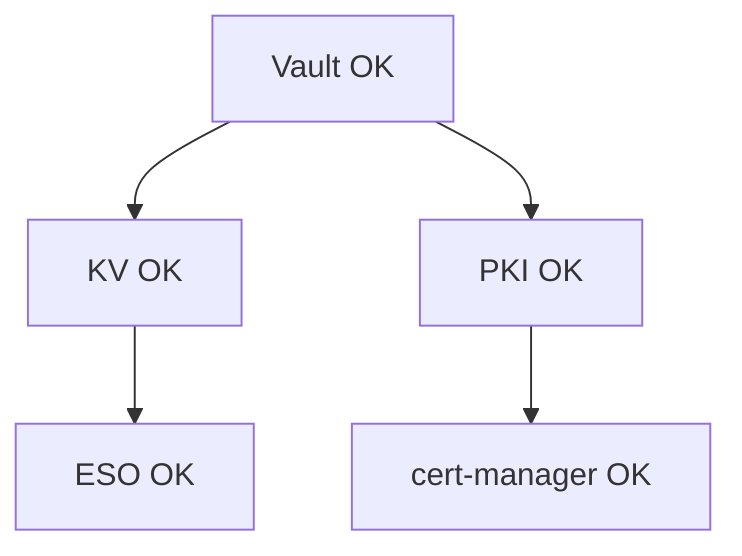

# Vault with OpenShift — Intermediate PKI and Secret Storage Tutorial

## Overview

This tutorial explains how to use **HashiCorp Vault** with **OpenShift** as:

- Intermediate Certificate Authority (PKI)
- Secret storage (KV)
- Integrated with:
  - cert-manager (for certificates)
  - External Secrets Operator (ESO) (for secrets)

---

# Architecture Diagram



---

# Topic 1 — Core Concepts

## KV (Key-Value)
Stores:
- passwords
- API keys
- configs

## PKI
Issues:
- TLS certificates
- intermediate CA

## Kubernetes Auth
Maps:
- ServiceAccount → Vault Role → Policy

---

# Topic 2 — Deployment Architecture



---

# Topic 3 — Setup Flow


---

# Topic 4 — Vault Setup Steps

## 1. Enable KV
```bash
vault secrets enable -path=kv -version=2 kv
```

## 2. Enable Kubernetes Auth
```bash
vault auth enable kubernetes
```

## 3. Configure Auth
```bash
vault write auth/kubernetes/config \
  kubernetes_host="https://kubernetes.default.svc" \
  kubernetes_ca_cert=@ca.crt \
  token_reviewer_jwt="$JWT"
```

---

# Topic 5 — PKI Intermediate Setup



## Enable PKI
```bash
vault secrets enable -path=pki pki
vault secrets tune -max-lease-ttl=8760h pki
```

## Generate CSR
```bash
vault write pki/intermediate/generate/internal common_name="Intermediate"
```

## Import cert
```bash
vault write pki/intermediate/set-signed certificate=@cert.pem
```

---

# Topic 6 — Policies

## ESO Policy
```hcl
path "kv/data/*" {
  capabilities = ["read"]
}
```

## cert-manager Policy
```hcl
path "pki/sign/*" {
  capabilities = ["update"]
}
```

---

# Topic 7 — Kubernetes Roles



---

# Topic 8 — cert-manager Integration

```yaml
apiVersion: cert-manager.io/v1
kind: ClusterIssuer
metadata:
  name: vault
spec:
  vault:
    server: https://vault
    path: pki/sign/role
```

---

# Topic 9 — ESO Integration

```yaml
apiVersion: external-secrets.io/v1
kind: ExternalSecret
metadata:
  name: app-secret
spec:
  data:
    - secretKey: password
      remoteRef:
        key: apps/app
        property: password
```

---

# Topic 10 — KV Flow



---

# Topic 11 — Validation



---

# Final Rules

- KV = secrets
- PKI = certificates
- ESO = KV only
- cert-manager = PKI only
- Use intermediate CA
- Keep root offline
