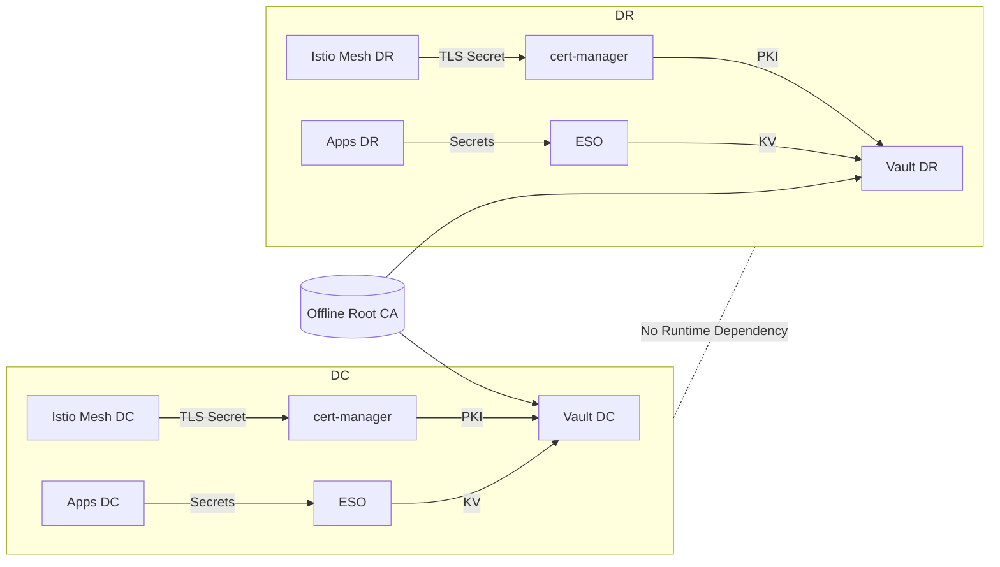

# Implementation Blueprint
## Vault OSS + cert-manager + ESO + Independent Istio Meshes (DC/DR)

---

## 1. Assumptions
- Two independent clusters: **DC** and **DR**
- Two independent Vault OSS clusters
- One offline Root CA
- One Intermediate CA per site
- cert-manager → PKI
- ESO → KV only
- Istio CA → mTLS

---

## 2. Namespace Layout

### Platform Namespaces

| Namespace           | Purpose |
|--------------------|--------|
| vault-system       | Vault cluster |
| cert-manager       | cert-manager controller |
| external-secrets   | ESO |
| istio-system       | Istio control plane |
| platform-secrets   | Shared secrets |
| app-*              | Applications |

---

## 3. Vault Mount Layout

### DC

| Path                 | Type | Purpose |
|----------------------|------|--------|
| auth/kubernetes-dc   | Auth | K8s auth |
| kv-dc                | KV   | Secrets |
| pki-ingress-dc       | PKI  | TLS |

### DR

| Path                 | Type | Purpose |
|----------------------|------|--------|
| auth/kubernetes-dr   | Auth | K8s auth |
| kv-dr                | KV   | Secrets |
| pki-ingress-dr       | PKI  | TLS |

---

## 4. Vault Roles

### DC Roles
- eso-kv-readonly-dc
- cert-manager-pki-issuer-dc
- breakglass-dc
- audit-read-dc

### DR Roles
- eso-kv-readonly-dr
- cert-manager-pki-issuer-dr
- breakglass-dr
- audit-read-dr

---

## 5. Policy Model

### KV Paths

**DC**
- kv-dc/data/platform/*
- kv-dc/data/apps/*

**DR**
- kv-dr/data/platform/*
- kv-dr/data/apps/*

---

## 6. PKI Layout

| Role                     | Site | Purpose |
|--------------------------|------|--------|
| role-istio-gateway-dc    | DC   | Gateway TLS |
| role-platform-ingress-dc | DC   | Platform TLS |
| role-istio-gateway-dr    | DR   | Gateway TLS |
| role-platform-ingress-dr | DR   | Platform TLS |

---

## 7. ESO Layout
- Prefer **SecretStore per namespace**
- Optional **ClusterSecretStore for platform**

---

## 8. cert-manager

| Site | Issuer |
|------|--------|
| DC   | vault-pki-ingress-dc |
| DR   | vault-pki-ingress-dr |

---

## 9. Deployment Phases

### Phase 1 — Root CA
- Generate offline CA
- Sign intermediates

### Phase 2 — Vault
- Deploy Vault
- Enable KV + PKI
- Configure auth

### Phase 3 — Platform
- Install Istio
- Install cert-manager
- Install ESO

### Phase 4 — Integration
- Configure ClusterIssuer
- Issue gateway cert

### Phase 5 — ESO
- Configure SecretStore
- Sync secrets

### Phase 6 — Apps
- Deploy apps
- Enable sidecar

### Phase 7 — DR Repeat
- Repeat with DR values

### Phase 8 — Failover
- Test DR independence
- Validate DNS switch

---

## 10. Mermaid Architecture Diagram

---

## 11. Key Rules

1. One site = one Vault + one PKI + one mesh  
2. cert-manager → PKI only  
3. ESO → KV only  
4. No cross-site dependency  
5. DR must be fully independent  

